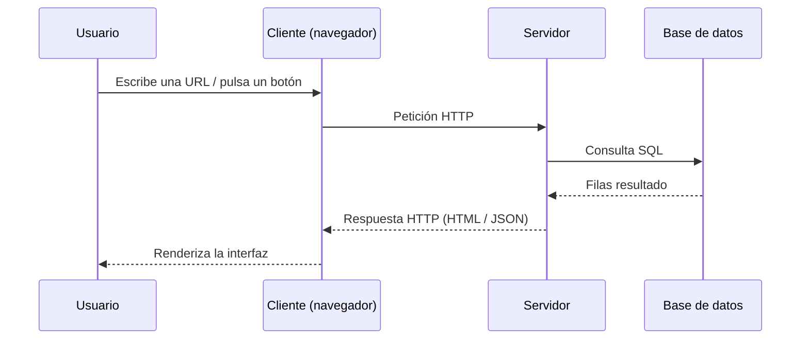
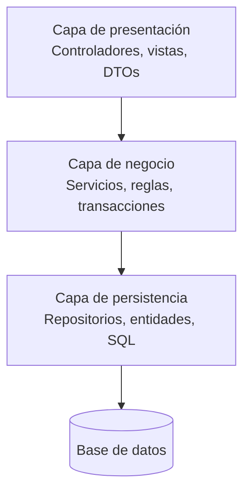
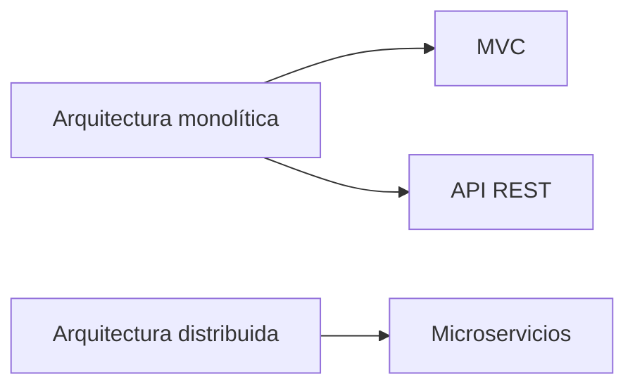
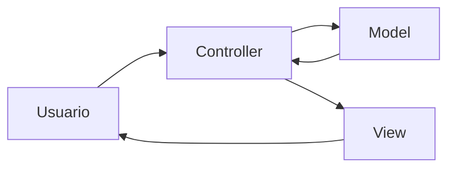
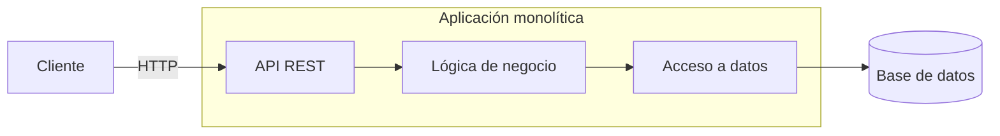
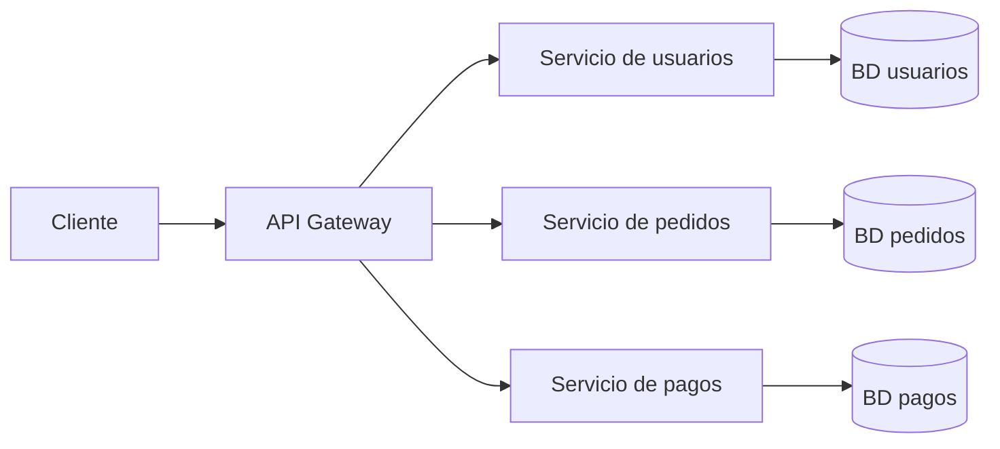
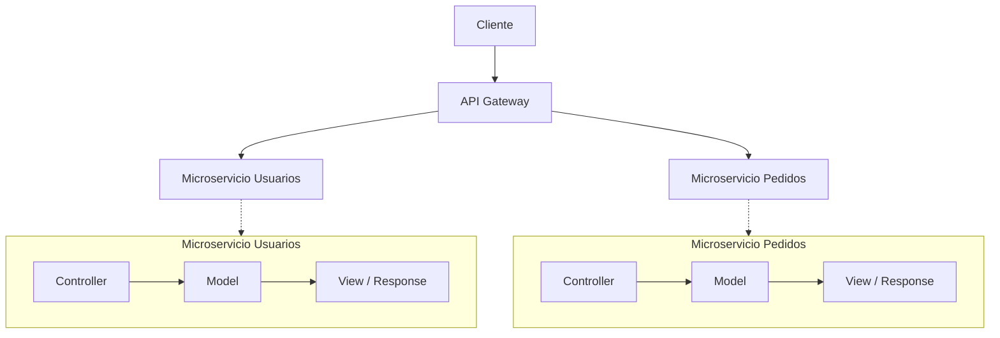

# 1. Arquitectura de las aplicaciones web

## 1.1. El modelo cliente-servidor

Una aplicación web es, en esencia, un programa **distribuido**: una parte se ejecuta en la máquina
del usuario y otra en una máquina remota, y ambas se comunican a través de una red siguiendo un
protocolo acordado.

:::info
En el modelo **cliente-servidor**, el *cliente* toma siempre la iniciativa
enviando una **petición** (*request*); el *servidor* permanece a la escucha y devuelve una
**respuesta** (*response*). El servidor nunca inicia la conversación en HTTP clásico.
:::



Las propiedades importantes de este modelo son:

- **Asimetría de roles**: cliente y servidor no son intercambiables.
- **Independencia tecnológica**: el cliente puede estar escrito en JavaScript y el servidor en Java;
  lo único que comparten es el protocolo y el formato de los datos.
- **Concurrencia**: un servidor atiende a miles de clientes simultáneamente, lo que obliga a pensar
  en hilos, *pools* de conexiones y estado compartido.

## 1.2. Etapas de una petición web

Cuando un usuario escribe `https://www.iesejemplo.es/alumnado` ocurre, resumidamente, esto:

1. **Resolución DNS**: el nombre `www.iesejemplo.es` se traduce a una dirección IP.
2. **Conexión TCP** al puerto 443 (o 80 si es HTTP sin cifrar).
3. **Handshake TLS** si es HTTPS: negociación de algoritmos y validación del certificado.
4. **Envío de la petición HTTP** con su método, ruta, cabeceras y, opcionalmente, cuerpo.
5. **Procesamiento en el servidor**: enrutado, lógica de negocio, acceso a datos.
6. **Envío de la respuesta HTTP** con código de estado, cabeceras y cuerpo.
7. **Renderizado en el cliente**: el navegador construye el DOM, aplica CSS y ejecuta JavaScript,
   lanzando probablemente **peticiones secundarias** (imágenes, hojas de estilo, fuentes, APIs).

:::warning
Es un error pensar que "una página" es "una petición". Una página moderna genera con
facilidad entre 30 y 150 peticiones HTTP. Puedes abrir las DevTools y contarlas para comprobarlo.
:::

## 1.3. Capas lógicas y niveles físicos

Conviene distinguir dos palabras que se confunden constantemente:

| Término | Significado | Ejemplo |
|--------|-------------|---------|
| **Capa** (*layer*) | División **lógica** del código | Capa de presentación, de negocio, de persistencia |
| **Nivel** (*tier*) | División **física** o de despliegue | Navegador / servidor de aplicaciones / servidor de BD |

Una aplicación puede tener **tres capas** y estar desplegada en **un solo nivel** (todo en el mismo
host), o al revés.

### La arquitectura en tres capas



En Spring Boot esta separación se traduce casi literalmente en anotaciones:

```java
@RestController          // capa de presentación
class AlumnoController { /* ... */ }

@Service                 // capa de negocio
class AlumnoService { /* ... */ }

@Repository              // capa de persistencia
interface AlumnoRepository extends JpaRepository<Alumno, Long> { }
```

:::info
**Regla de dependencia.** Las dependencias apuntan **hacia dentro**: la presentación conoce al
negocio, el negocio conoce a la persistencia, y nunca al revés. Un `@Repository` que importe una
clase del paquete `controller` es una señal de alarma.
:::

## 1.4. Estilos arquitectónicos

### Estilos arquitectónicos: MVC, API REST y microservicios

Los estilos arquitectónicos definen cómo se organizan los componentes de una aplicación, cómo se comunican entre sí y cómo se despliega el sistema.

En este documento se analizan tres conceptos habituales:

- **MVC (Model-View-Controller)**: patrón para organizar la estructura interna de una aplicación.
- **API REST**: estilo para diseñar interfaces de comunicación mediante HTTP.
- **Microservicios**: estilo arquitectónico que divide una aplicación en servicios independientes.

Una distinción importante es que estos conceptos **no pertenecen exactamente al mismo nivel arquitectónico**. MVC puede utilizarse dentro de un monolito, una API REST puede formar parte de un monolito o de un sistema distribuido, y los microservicios suelen implicar una arquitectura distribuida.

#### Clasificación según el uso de arquitectura monolítica

| Estilo | ¿Puede ser monolítico? | ¿Implica distribución? | Nivel principal |
|---|---|---|---|
| **MVC** | Sí | No | Organización interna de la aplicación |
| **API REST** | Sí | No necesariamente | Comunicación / interfaz |
| **Microservicios** | No, conceptualmente | Sí | Arquitectura del sistema |

Por tanto:



:::note
MVC y REST pueden coexistir. Por ejemplo, un monolito puede estar estructurado internamente con MVC y exponer una API REST.
:::

---

### 1. Arquitectura monolítica

Antes de analizar los estilos, conviene entender qué caracteriza a una arquitectura monolítica.

En un **monolito**, las principales funcionalidades de la aplicación forman parte de una única unidad desplegable.

Esto no significa necesariamente que el código esté desorganizado. Un monolito puede estar perfectamente modularizado y utilizar patrones como MVC.

Una característica fundamental es que todos estos componentes se despliegan como una misma aplicación.

#### Ventajas

- Simplicidad inicial.
- Fácil desarrollo y depuración.
- Despliegue relativamente sencillo.
- Las llamadas entre componentes suelen ser locales.
- No requiere gestionar inicialmente problemas de comunicación entre servicios.

#### Desventajas

- El crecimiento del proyecto puede aumentar su complejidad.
- Un cambio puede requerir desplegar toda la aplicación.
- El escalado suele hacerse sobre la aplicación completa.
- Un fallo en determinadas partes puede afectar a toda la aplicación.
- Separar equipos y responsabilidades puede resultar más complicado a gran escala.

---

### 2. MVC

**MVC (Model-View-Controller)** es un patrón arquitectónico que separa una aplicación en tres responsabilidades principales:

- **Model**: representa los datos y la lógica relacionada con ellos.
- **View**: se encarga de presentar la información al usuario.
- **Controller**: recibe las peticiones y coordina la interacción entre el modelo y la vista.

MVC se utiliza frecuentemente dentro de aplicaciones monolíticas, aunque el patrón también puede aparecer en sistemas con arquitecturas más complejas.



#### Ventajas de MVC

- Separación clara de responsabilidades.
- Facilita el mantenimiento del código.
- Permite trabajar de forma más independiente sobre presentación, control y datos.
- Es un patrón conocido y ampliamente utilizado.

#### Desventajas

- No resuelve por sí mismo problemas de escalabilidad distribuida.
- Una aplicación MVC puede seguir siendo un monolito.
- La separación lógica no implica separación física de los componentes.

---

### 3. API REST

**REST (Representational State Transfer)** es un estilo arquitectónico para diseñar sistemas de comunicación, especialmente APIs web.

REST utiliza habitualmente HTTP y recursos identificables mediante URLs.

Por ejemplo:

```text
GET    /users
GET    /users/42
POST   /users
PUT    /users/42
DELETE /users/42
```

#### API REST en un monolito

Una aplicación monolítica puede exponer una API REST para que otros clientes accedan a sus funcionalidades.



En este escenario, la API REST es la **interfaz de comunicación**, pero internamente existe una única aplicación.

---

### 4. Microservicios

Los **microservicios** son un estilo arquitectónico en el que una aplicación se divide en múltiples servicios independientes.

Cada servicio suele estar especializado en una determinada capacidad de negocio y puede desarrollarse, desplegarse y escalarse de manera independiente.



A diferencia del monolito, los componentes principales son **unidades de despliegue independientes**.

#### Ventajas

- **Escalabilidad:** permite escalar únicamente los servicios que necesitan más recursos.
- **Despliegues independientes:** cada servicio puede actualizarse sin desplegar toda la aplicación.
- **Aislamiento:** un fallo puede limitarse a un servicio concreto si existen mecanismos de resiliencia.
- **Organización por dominio:** los servicios pueden estructurarse según capacidades de negocio.

#### Desventajas

- **Mayor complejidad:** comunicación y gestión de fallos mediante red.
- **Latencia:** las llamadas entre servicios pueden introducir retrasos.
- **Observabilidad y trazabilidad:** resulta más difícil seguir y diagnosticar una petición.
- **Infraestructura:** requiere gestionar múltiples servicios y despliegues.
- **Datos:** mantener la consistencia entre servicios es más complejo.
- **DevOps:** requiere mayor automatización y buenas prácticas.

Por ello:

> **Microservicios no son simplemente "un monolito dividido en varias aplicaciones".**

La distribución introduce nuevos problemas que no existen, o son mucho menores, dentro de un monolito.

---

### 5. MVC + REST + Microservicios

Los tres conceptos pueden utilizarse conjuntamente.

Por ejemplo, cada microservicio puede exponer una API REST y organizar internamente su código utilizando MVC.



En una API orientada exclusivamente a proporcionar datos, la parte **View** de MVC puede no existir como una vista HTML tradicional. El controlador puede devolver directamente representaciones como JSON.

Por ejemplo:

```http
GET /users/42
```

Podría producir:

```json
{
  "id": 42,
  "name": "Ana",
  "email": "ana@example.com"
}
```

---

### 6. Comparación

| Característica | MVC | API REST | Microservicios |
|---|---|---|---|
| Principal objetivo | Organizar el código | Definir comunicación | Dividir el sistema |
| Monolítico | Frecuente | Posible | No es el objetivo |
| Distribuido | No necesariamente | No necesariamente | Sí |
| Independencia de despliegue | No | No implica | Sí |
| Escalado independiente | No | No implica | Sí |
| Separación de responsabilidades | Sí | A nivel de interfaz | Sí, a nivel de servicios |
| Complejidad | Baja-media | Media | Alta |
| Puede combinarse con los demás | Sí | Sí | Sí |

---

## 1.5. Aplicación web vs. sitio web vs. API

| Tipo | Qué devuelve | Ejemplo |
|------|--------------|---------|
| **Sitio web estático** | Ficheros tal cual | Documentación, blog generado |
| **Aplicación web** | HTML generado dinámicamente | Aula virtual, tienda online |
| **API web** | Datos estructurados (JSON/XML) | Backend de una app móvil |

Spring Boot sirve para los tres casos. En este módulo trabajaremos sobre todo los dos últimos.