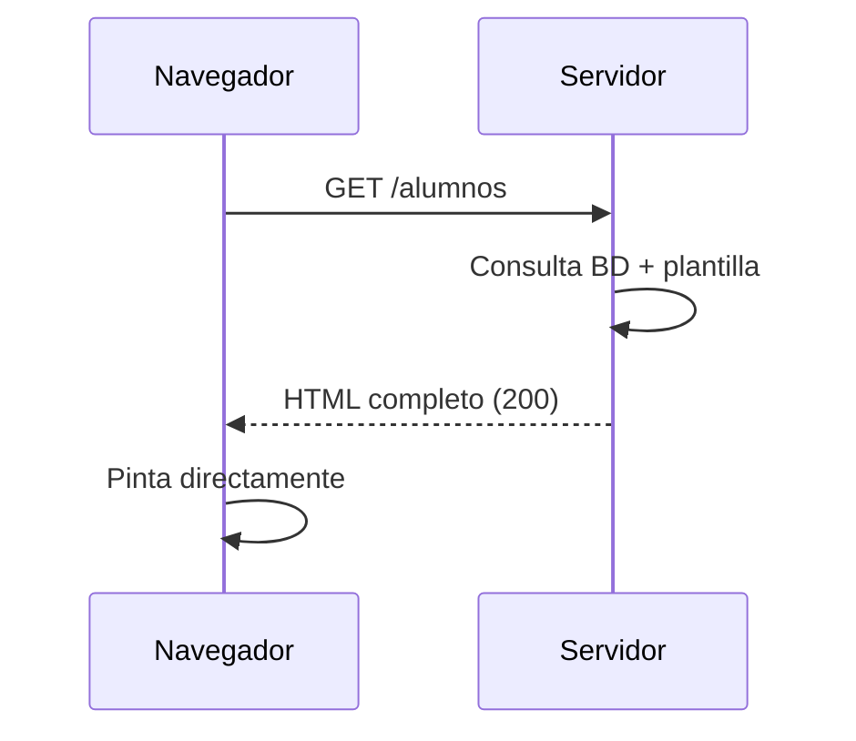
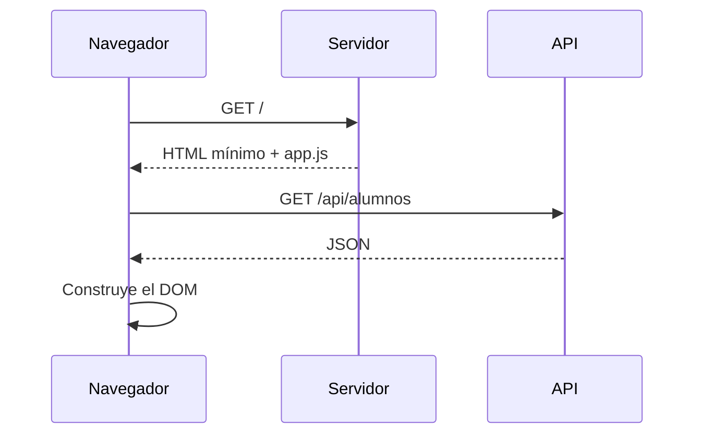

import Tabs from '@theme/Tabs';
import TabItem from '@theme/TabItem';

# 2. Ejecución en cliente vs. ejecución en servidor

El nombre del módulo es *Desarrollo web en entorno **servidor***. Toca definir con precisión qué
significa ese "entorno servidor" y qué queda fuera.

## 2.1. Dos máquinas, dos entornos de ejecución

| | **Cliente** | **Servidor** |
|---|---|---|
| Dónde corre | Navegador del usuario | Máquina remota que controlas |
| Quién lo controla | El usuario (¡puede modificarlo!) | La organización |
| Lenguajes | JavaScript, WebAssembly | Java, PHP, Python, C#, Go, Node.js… |
| Ve el código fuente | Sí, siempre | No |
| Acceso a BD, ficheros, secretos | No | Sí |
| Recursos | Limitados e impredecibles | Conocidos y escalables |
| Fallos | Afectan a un usuario | Pueden afectar a todos |

📌 **Concepto clave.** Todo lo que se ejecuta en el cliente es **no confiable**. El usuario puede
leerlo, modificarlo, saltárselo o falsificarlo. Toda validación relevante debe repetirse **en el
servidor**.

## 2.2. El mismo problema resuelto en los dos lados

Imaginemos la validación de un formulario de alta de alumno.

<Tabs>
<TabItem value="cliente" label="En el cliente" default>

```javascript
// Mejora la experiencia: respuesta inmediata, sin viaje a la red.
const form = document.querySelector('#alta');
form.addEventListener('submit', (e) => {
  const email = form.email.value;
  if (!email.includes('@')) {
    e.preventDefault();
    mostrarError('El correo no es válido');
  }
});
```

Ventaja: feedback instantáneo.
Límite: cualquiera puede desactivar JavaScript o enviar la petición con `curl`.

</TabItem>
<TabItem value="servidor" label="En el servidor">

```java
public record AltaAlumnoRequest(
    @NotBlank String nombre,
    @Email @NotBlank String email,
    @Min(16) int edad
) {}

@PostMapping("/alumnos")
public ResponseEntity<AlumnoDTO> alta(@Valid @RequestBody AltaAlumnoRequest req) {
    return ResponseEntity.status(HttpStatus.CREATED)
                         .body(servicio.alta(req));
}
```

Ventaja: es la única validación que **no se puede evitar**.
Límite: requiere un viaje de red.

</TabItem>
</Tabs>

:::danger Regla de oro
La validación en cliente es **usabilidad**. La validación en servidor es **seguridad**.
No son alternativas: se hacen las dos.
:::

## 2.3. Estrategias de renderizado

### SSR — *Server-Side Rendering*

El servidor genera el HTML completo y lo envía listo para pintar. Es el modelo clásico (JSP,
Thymeleaf, PHP, Django).



- ✅ Primer pintado rápido, SEO excelente, funciona sin JS.
- ❌ Recarga completa en cada navegación; más carga de CPU en servidor.

### CSR — *Client-Side Rendering*

El servidor envía un HTML casi vacío y un *bundle* de JavaScript; la interfaz se construye en el
navegador y los datos llegan por una API JSON.



- ✅ Navegación fluida tipo aplicación; el backend se reduce a una API reutilizable.
- ❌ Primer pintado lento, SEO más complicado, dependencia total de JS.

### SSG — *Static Site Generation*

El HTML se genera **en tiempo de compilación**. Es exactamente lo que hace Docusaurus con este
mismo curso: el resultado son ficheros estáticos servibles desde un CDN.

### Hidratación e híbridos

Los frameworks modernos (Next.js, Nuxt, Qwik) combinan enfoques: HTML renderizado en servidor que
luego se "hidrata" con JavaScript en cliente para volverse interactivo.

| Estrategia | Primer pintado | SEO | Interactividad | Coste servidor |
|-----------|----------------|-----|----------------|----------------|
| SSR | Rápido | Muy bueno | Media | Alto |
| CSR | Lento | Requiere trabajo | Alta | Bajo |
| SSG | Muy rápido | Muy bueno | Baja | Mínimo |
| Híbrido | Rápido | Muy bueno | Alta | Medio |

## 2.4. ¿Dónde encaja Spring Boot?

Spring Boot vive **siempre en el servidor**, y puede desempeñar dos papeles:

<Tabs>
<TabItem value="mvc" label="Como aplicación SSR" default>

Con **Spring MVC + Thymeleaf**, el controlador devuelve el nombre de una plantilla:

```java
@Controller
public class AlumnoWebController {

    @GetMapping("/alumnos")
    public String listado(Model model) {
        model.addAttribute("alumnos", servicio.buscarTodos());
        return "alumnos/listado";   // -> templates/alumnos/listado.html
    }
}
```

</TabItem>
<TabItem value="api" label="Como API REST">

Con **`@RestController`**, el controlador devuelve datos serializados a JSON:

```java
@RestController
@RequestMapping("/api/alumnos")
public class AlumnoApiController {

    @GetMapping
    public List<AlumnoDTO> listado() {
        return servicio.buscarTodos();
    }
}
```

</TabItem>
</Tabs>

La diferencia entre `@Controller` y `@RestController` es exactamente esa: el segundo equivale al
primero más `@ResponseBody` en todos sus métodos.

## 2.5. Qué NO debe hacerse nunca en el cliente

- Comprobar permisos o roles como única barrera (ocultar un botón **no** protege el endpoint).
- Guardar claves de API, secretos o credenciales de base de datos.
- Calcular precios finales, descuentos o saldos.
- Confiar en campos ocultos (`<input type="hidden">`) enviados por el formulario.

⚠️ **Error típico de examen.** "Como el botón de borrar sólo se muestra al administrador, el
endpoint está protegido". Falso: cualquiera puede lanzar `DELETE /api/alumnos/5` con curl.

## 2.6. Actividades

🔧 **A2.1.** Toma un formulario con validación JavaScript y salta la validación enviando la petición
directamente con `curl`. Documenta el resultado.

🔧 **A2.2.** Clasifica cinco sitios web que uses como SSR, CSR, SSG o híbrido. Justifícalo con
evidencias de DevTools (¿el HTML inicial ya contiene el contenido?).

🔧 **A2.3.** Enumera cinco tareas que sólo puedan hacerse en el servidor y cinco que sólo tengan
sentido en el cliente.
