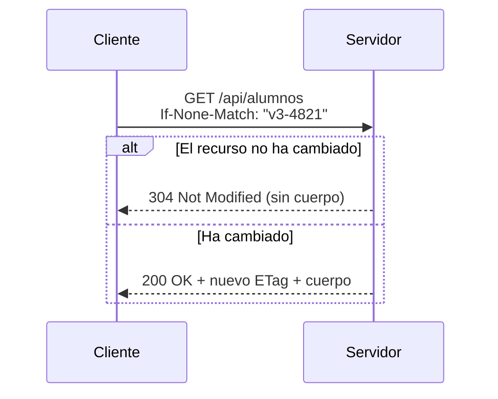

# 5. Cabeceras HTTP

Las **cabeceras** son pares `Nombre: valor` que acompañan a cada mensaje y transportan **metadatos**:
quién pregunta, en qué formato quiere la respuesta, qué se puede cachear, cómo está codificado el
cuerpo, qué credenciales se presentan…

📌 Los nombres de cabecera son **insensibles a mayúsculas** (`Content-Type` ≡ `content-type`).
En HTTP/2 y HTTP/3 se transmiten siempre en minúsculas.

## 5.1. Clasificación

| Tipo | Descripción | Ejemplos |
|------|-------------|----------|
| **Generales** | Válidas en petición y respuesta | `Date`, `Connection`, `Cache-Control` |
| **De petición** | Información sobre el cliente o lo que desea | `Accept`, `User-Agent`, `Authorization` |
| **De respuesta** | Información sobre el servidor o la respuesta | `Server`, `Location`, `Set-Cookie` |
| **De entidad** | Describen el cuerpo del mensaje | `Content-Type`, `Content-Length`, `ETag` |

Además, cualquiera puede definir cabeceras propias (`X-Peticion-Id`, `X-Centro`…).

## 5.2. Cabeceras de petición esenciales

```http
GET /api/alumnos HTTP/1.1
Host: api.centro.es
User-Agent: Mozilla/5.0 (X11; Linux x86_64) Firefox/128.0
Accept: application/json, text/plain;q=0.8, */*;q=0.5
Accept-Language: es-ES,es;q=0.9,en;q=0.6
Accept-Encoding: gzip, deflate, br
Authorization: Bearer eyJhbGciOi...
Referer: https://centro.es/panel
Cookie: JSESSIONID=9A3F...; tema=oscuro
If-None-Match: "v3-4821"
Connection: keep-alive
```

| Cabecera | Para qué sirve |
|----------|----------------|
| `Host` | Dominio solicitado. **Obligatoria** desde HTTP/1.1 (permite *virtual hosting*) |
| `User-Agent` | Identifica navegador y sistema del cliente |
| `Accept` | Formatos que el cliente acepta, con preferencias |
| `Accept-Language` | Idiomas preferidos |
| `Accept-Encoding` | Compresiones soportadas |
| `Authorization` | Credenciales (`Basic`, `Bearer`, `Digest`) |
| `Referer` | Página desde la que se originó la petición (sí, con la errata histórica) |
| `Cookie` | Cookies previamente almacenadas para ese dominio |
| `If-None-Match` / `If-Modified-Since` | Peticiones condicionales para caché |
| `Origin` | Origen del documento; base de CORS |

### Negociación de contenido y factor `q`

El **factor de calidad** `q` (entre 0 y 1, por defecto 1) expresa preferencias:

```http
Accept: application/json;q=1.0, application/xml;q=0.8, */*;q=0.1
```

"Prefiero JSON; si no puede ser, XML; en último caso, lo que tengas."
El servidor elige y lo comunica con `Content-Type` y, si procede, con `Vary: Accept`.

## 5.3. Cabeceras de respuesta esenciales

```http
HTTP/1.1 200 OK
Date: Tue, 15 Sep 2026 09:12:44 GMT
Server: nginx
Content-Type: application/json;charset=UTF-8
Content-Length: 1843
Content-Encoding: gzip
Cache-Control: public, max-age=300
ETag: "v3-4821"
Last-Modified: Mon, 14 Sep 2026 18:00:00 GMT
Vary: Accept-Encoding, Accept-Language
Set-Cookie: JSESSIONID=9A3F...; Path=/; HttpOnly; Secure; SameSite=Lax
Location: /api/alumnos/42
```

| Cabecera | Para qué sirve |
|----------|----------------|
| `Content-Type` | Tipo MIME + juego de caracteres del cuerpo |
| `Content-Length` | Tamaño en bytes del cuerpo |
| `Content-Disposition` | Fuerza descarga y nombre de archivo |
| `Location` | Destino en redirecciones (3xx) o recurso creado (201) |
| `Set-Cookie` | Pide al cliente que almacene una cookie |
| `ETag` | Identificador de versión del recurso |
| `Vary` | Qué cabeceras de petición afectan a la respuesta (clave para cachés) |
| `Retry-After` | Cuánto esperar antes de reintentar (429, 503) |
| `Allow` | Métodos permitidos sobre el recurso (405) |

### Tipos MIME más frecuentes

| MIME | Uso |
|------|-----|
| `text/html` | Documentos HTML |
| `text/plain` | Texto plano |
| `text/css`, `application/javascript` | Recursos web |
| `application/json` | APIs REST |
| `application/xml` | Intercambio XML |
| `application/x-www-form-urlencoded` | Formulario clásico |
| `multipart/form-data` | Formulario con ficheros |
| `application/pdf`, `image/png`, `image/webp` | Binarios |
| `application/octet-stream` | Binario genérico |
| `text/event-stream` | Server-Sent Events |

⚠️ **Error típico.** Olvidar `;charset=UTF-8` y ver acentos rotos. Spring Boot lo configura por
defecto, pero al servir contenido manualmente conviene comprobarlo.

## 5.4. Caché

La caché es el mecanismo de optimización más rentable de la web. Se controla con `Cache-Control`:

```http
Cache-Control: public, max-age=31536000, immutable   # recurso versionado (app.8f3d2.js)
Cache-Control: private, max-age=0, must-revalidate   # HTML de usuario autenticado
Cache-Control: no-store                              # datos sensibles: nunca almacenar
```

| Directiva | Significado |
|-----------|-------------|
| `public` | Puede almacenarla cualquier caché, incluidos proxies |
| `private` | Sólo el navegador del usuario |
| `no-cache` | Puede almacenarse, pero hay que **revalidar** antes de usarla |
| `no-store` | No se almacena en ningún sitio |
| `max-age=N` | Segundos de validez |
| `must-revalidate` | Al caducar, revalidación obligatoria |

### Validación condicional



Un `304` ahorra todo el ancho de banda del cuerpo. En Spring:

```java
@GetMapping("/{id}")
public ResponseEntity<AlumnoDTO> obtener(@PathVariable Long id) {
    Alumno a = servicio.obtener(id);
    return ResponseEntity.ok()
            .eTag("\"" + a.getVersion() + "\"")
            .cacheControl(CacheControl.maxAge(Duration.ofMinutes(5)).cachePublic())
            .body(AlumnoDTO.from(a));
}
```

## 5.5. Cabeceras de seguridad

| Cabecera | Protege frente a |
|----------|------------------|
| `Strict-Transport-Security` | Degradación a HTTP (*downgrade*) |
| `Content-Security-Policy` | XSS e inyección de recursos |
| `X-Content-Type-Options: nosniff` | Adivinación de tipo MIME |
| `X-Frame-Options` / `frame-ancestors` | *Clickjacking* |
| `Referrer-Policy` | Fuga de URLs internas |
| `Permissions-Policy` | Acceso a cámara, micrófono, geolocalización |

Ejemplo de configuración en Spring Security:

```java
@Bean
SecurityFilterChain filtros(HttpSecurity http) throws Exception {
    http.headers(h -> h
        .contentSecurityPolicy(csp -> csp.policyDirectives("default-src 'self'"))
        .frameOptions(f -> f.deny())
        .httpStrictTransportSecurity(hsts -> hsts.maxAgeInSeconds(31536000))
    );
    return http.build();
}
```

## 5.6. Trabajar con cabeceras en Spring Boot

### Leerlas

```java
@GetMapping("/eco")
public Map<String, String> eco(
        @RequestHeader("User-Agent") String agente,
        @RequestHeader(value = "X-Centro", required = false) String centro,
        @RequestHeader HttpHeaders todas) {

    return Map.of(
        "agente", agente,
        "centro", centro == null ? "desconocido" : centro,
        "total", String.valueOf(todas.size())
    );
}
```

### Escribirlas

```java
@GetMapping("/informe")
public ResponseEntity<byte[]> informe() {
    byte[] pdf = generador.generar();
    return ResponseEntity.ok()
            .header(HttpHeaders.CONTENT_DISPOSITION,
                    "attachment; filename=\"informe-2026.pdf\"")
            .contentType(MediaType.APPLICATION_PDF)
            .body(pdf);
}
```

### Añadirlas a todas las respuestas con un filtro

```java
@Component
public class CabeceraTrazaFilter implements Filter {

    @Override
    public void doFilter(ServletRequest req, ServletResponse res, FilterChain chain)
            throws IOException, ServletException {
        ((HttpServletResponse) res).setHeader("X-Peticion-Id", UUID.randomUUID().toString());
        chain.doFilter(req, res);
    }
}
```

:::info Enlace con la POA
Este filtro resuelve una necesidad **transversal**: afecta a todas las peticiones y no pertenece a
ninguna regla de negocio. Es exactamente el tipo de problema que la programación orientada a
aspectos formaliza. Lo retomaremos en el capítulo 9.
:::

## 5.7. Actividades

🔧 **A5.1.** Analiza las cabeceras de respuesta de tres sitios distintos y evalúa su postura de
seguridad: ¿tienen HSTS? ¿CSP? ¿`nosniff`?

🔧 **A5.2.** Lanza la misma petición con `Accept: application/json` y con `Accept: application/xml`
contra una API pública y compara las respuestas.

🔧 **A5.3.** Provoca deliberadamente un `304 Not Modified` usando `curl` con `If-None-Match`.

🔧 **A5.4.** Explica qué ocurriría si un CDN cachea una respuesta `private` de un usuario
autenticado. Relaciónalo con `Vary` y con `Cache-Control`.
