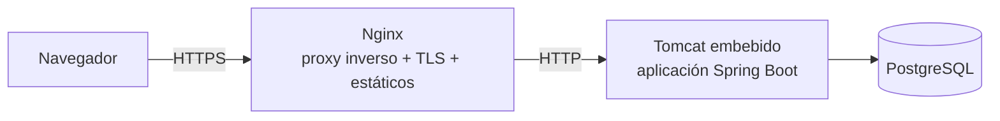
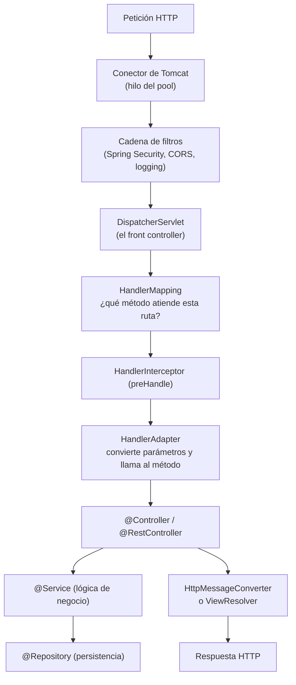

# 8. Servidores web, contenedores y el entorno Java

## 8.1. Tres conceptos que se confunden

| Concepto | Qué hace | Ejemplos |
|----------|----------|----------|
| **Servidor web** | Atiende HTTP y sirve ficheros estáticos; suele actuar como proxy inverso | Apache HTTP Server, **Nginx**, Caddy |
| **Contenedor de servlets** | Ejecuta código Java que genera respuestas dinámicas | **Tomcat**, Jetty, Undertow |
| **Servidor de aplicaciones** | Contenedor + servicios Jakarta EE completos (EJB, JTA, JMS…) | WildFly, Payara, WebSphere |

En una arquitectura típica conviven:



¿Por qué un proxy inverso delante? Para terminar TLS, repartir carga entre instancias, servir
estáticos con eficiencia, aplicar límites de peticiones y ocultar la topología interna.

## 8.2. La API Servlet

📌 Un **servlet** es una clase Java que atiende peticiones HTTP dentro de un contenedor. Es la base
sobre la que se construye Spring MVC. Desde Jakarta EE 9 el paquete es `jakarta.servlet`
(antes `javax.servlet`) — un detalle que explica muchos errores al migrar proyectos antiguos.

```java
@WebServlet("/saludo")
public class SaludoServlet extends HttpServlet {

    @Override
    protected void doGet(HttpServletRequest req, HttpServletResponse resp)
            throws IOException {
        String nombre = req.getParameter("nombre");
        resp.setContentType("text/html;charset=UTF-8");
        resp.setStatus(HttpServletResponse.SC_OK);
        resp.getWriter().println("<h1>Hola, " + nombre + "</h1>");
    }
}
```

### Ciclo de vida de un servlet

1. **`init()`** — una sola vez, al cargarse.
2. **`service()`** — en cada petición; delega en `doGet`, `doPost`, etc.
3. **`destroy()`** — al descargar la aplicación.

⚠️ **Consecuencia crítica.** El contenedor crea **una sola instancia** del servlet y la comparte
entre todos los hilos. Cualquier campo de instancia mutable es **estado compartido** y fuente de
errores de concurrencia. La misma regla se aplica a los *beans* singleton de Spring.

### Filtros

Un **filtro** intercepta peticiones antes y/o después del servlet:

```java
@Component
@Order(1)
public class TiempoRespuestaFilter implements Filter {

    private static final Logger log = LoggerFactory.getLogger(TiempoRespuestaFilter.class);

    @Override
    public void doFilter(ServletRequest req, ServletResponse res, FilterChain chain)
            throws IOException, ServletException {
        long inicio = System.nanoTime();
        try {
            chain.doFilter(req, res);            // continúa la cadena
        } finally {
            long ms = (System.nanoTime() - inicio) / 1_000_000;
            log.info("{} {} -> {} ms",
                     ((HttpServletRequest) req).getMethod(),
                     ((HttpServletRequest) req).getRequestURI(), ms);
        }
    }
}
```

📌 Los filtros son el primer ejemplo real de **interceptación**: código que se ejecuta "alrededor"
de otro código sin que este lo sepa. Guarda esta idea: es el puente directo hacia el capítulo 9.

## 8.3. El recorrido de una petición en Spring Boot



Los elementos clave:

| Pieza | Responsabilidad |
|-------|-----------------|
| **`DispatcherServlet`** | *Front controller*: único punto de entrada que orquesta todo |
| **`HandlerMapping`** | Resuelve qué método de qué controlador atiende la petición |
| **`HandlerAdapter`** | Enlaza parámetros (`@PathVariable`, `@RequestBody`…) e invoca el método |
| **`HttpMessageConverter`** | Serializa/deserializa (Jackson para JSON) |
| **`ViewResolver`** | Localiza la plantilla en aplicaciones SSR |
| **`HandlerExceptionResolver`** | Traduce excepciones en respuestas HTTP |

### Filtro vs. interceptor vs. aspecto

| | Filtro | `HandlerInterceptor` | Aspecto (AOP) |
|---|---|---|---|
| Nivel | API Servlet | Spring MVC | Cualquier *bean* de Spring |
| Conoce el controlador destino | No | Sí | Sí (método y argumentos) |
| Acceso al cuerpo ya deserializado | No | Parcial | Sí |
| Uso típico | CORS, seguridad, compresión | Auditoría web, cabeceras comunes | Transacciones, caché, trazas, permisos |

## 8.4. Tomcat embebido y empaquetado

Spring Boot invierte el modelo tradicional: en lugar de desplegar un `.war` dentro de un Tomcat
instalado, **empaqueta Tomcat dentro de tu aplicación**.

```bash
mvn clean package
java -jar target/gestion-academica-0.0.1-SNAPSHOT.jar
```

```properties
# application.properties
server.port=8080
server.servlet.context-path=/api
server.tomcat.threads.max=200
server.tomcat.connection-timeout=20s
server.compression.enabled=true
```

Alternativas al contenedor por defecto:

```xml
<dependency>
  <groupId>org.springframework.boot</groupId>
  <artifactId>spring-boot-starter-web</artifactId>
  <exclusions>
    <exclusion>
      <groupId>org.springframework.boot</groupId>
      <artifactId>spring-boot-starter-tomcat</artifactId>
    </exclusion>
  </exclusions>
</dependency>
<dependency>
  <groupId>org.springframework.boot</groupId>
  <artifactId>spring-boot-starter-undertow</artifactId>
</dependency>
```

| Contenedor | Rasgo distintivo |
|-----------|------------------|
| **Tomcat** | Por defecto, maduro, la opción segura |
| **Jetty** | Ligero, muy usado en sistemas embebidos |
| **Undertow** | No bloqueante, alto rendimiento |
| **Netty** | Usado por Spring WebFlux (reactivo) |

## 8.5. Modelo de hilos: bloqueante vs. reactivo

- **Spring MVC (bloqueante)**: un hilo por petición. Mientras espera a la base de datos, el hilo
  queda ocupado sin hacer nada. Simple de programar y depurar.
- **Spring WebFlux (reactivo)**: pocos hilos gestionando muchas peticiones mediante eventos. Mayor
  rendimiento con alta concurrencia y E/S lenta, a costa de un modelo mental más difícil.
- **Hilos virtuales (Java 21+)**: permiten escribir código bloqueante con escalabilidad cercana a la
  reactiva. Se activan con:

```properties
spring.threads.virtual.enabled=true
```

:::tip En este módulo
Trabajaremos con **Spring MVC sobre Tomcat embebido**. Es el estándar de la industria para
aplicaciones de gestión y el punto de partida correcto.
:::

## 8.6. Actividades

🔧 **A8.1.** Crea un proyecto en [start.spring.io](https://start.spring.io) con la dependencia *Spring
Web*, arráncalo y localiza en la consola la línea donde Tomcat indica el puerto.

🔧 **A8.2.** Escribe un filtro que registre método, ruta, código de estado y duración de cada
petición. Compruébalo con varias llamadas.

🔧 **A8.3.** Cambia el puerto y el *context path* por propiedades y verifica el efecto.

🔧 **A8.4.** Investiga y redacta media página: ¿qué ventajas operativas aporta empaquetar el
servidor dentro del `.jar` frente al despliegue clásico de `.war`?
