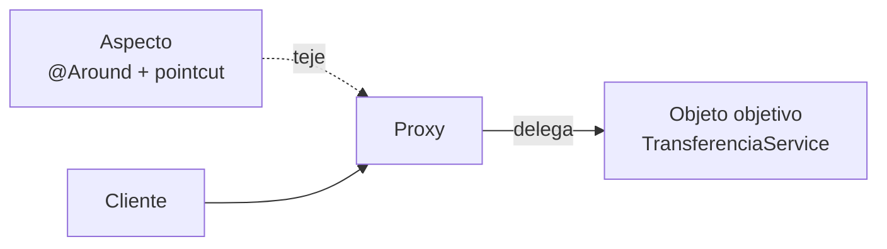
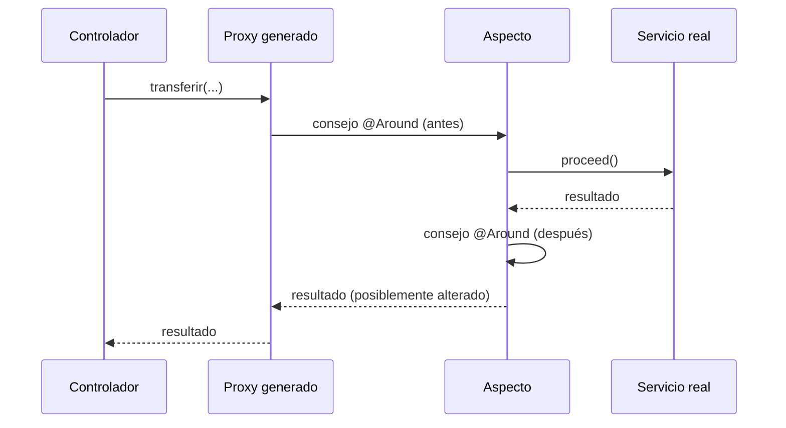

import Tabs from '@theme/Tabs';
import TabItem from '@theme/TabItem';

# 9. Programación orientada a aspectos (POA)

## 9.1. El problema: preocupaciones transversales

Observa este servicio. La lógica de negocio real ocupa **una línea**; el resto es ruido:

```java
public class TransferenciaService {

    public void transferir(Long origen, Long destino, BigDecimal importe) {
        long inicio = System.currentTimeMillis();                 // métricas
        log.info("Iniciando transferencia {} -> {}", origen, destino);  // trazas

        if (!seguridad.tienePermiso("TRANSFERIR")) {              // seguridad
            throw new AccesoDenegadoException();
        }
        if (importe.signum() <= 0) {                              // validación
            throw new IllegalArgumentException("Importe inválido");
        }

        Transaction tx = em.getTransaction();                     // transacción
        tx.begin();
        try {
            cuentas.mover(origen, destino, importe);              // ← NEGOCIO
            tx.commit();
        } catch (Exception e) {
            tx.rollback();                                        // transacción
            log.error("Error en transferencia", e);               // trazas
            throw e;
        } finally {
            metricas.registrar("transferir", System.currentTimeMillis() - inicio);
        }
    }
}
```

📌 **Concepto.** Una **preocupación transversal** (*cross-cutting concern*) es una funcionalidad
necesaria que **atraviesa muchos módulos** y no pertenece de forma natural a ninguno: trazas,
seguridad, transacciones, caché, métricas, auditoría, reintentos.

La programación orientada a objetos las modulariza mal: acaban **dispersas** (el mismo código en
cientos de métodos) y **enredadas** (mezcladas con el negocio).

## 9.2. La solución: aspectos

📌 La **POA** propone extraer esas preocupaciones a módulos independientes llamados **aspectos**, y
declarar **dónde** deben aplicarse. Un componente externo se encarga de combinarlas con el código
base.

Con POA, el servicio anterior se reduce a:

```java
@Service
public class TransferenciaService {

    @Transactional
    @PreAuthorize("hasAuthority('TRANSFERIR')")
    @Traza
    public void transferir(Long origen, Long destino, BigDecimal importe) {
        cuentas.mover(origen, destino, importe);
    }
}
```

La lógica transversal sigue ejecutándose — simplemente ya no está escrita ahí.

:::info POO y POA no compiten
La POA **complementa** a la POO. La POO descompone el dominio en objetos; la POA descompone lo que
la POO no sabe descomponer bien.
:::

## 9.3. Terminología

| Término (ES) | Término (EN) | Definición |
|--------------|--------------|------------|
| **Aspecto** | *Aspect* | Módulo que encapsula una preocupación transversal |
| **Punto de unión** | *Join point* | Punto del programa donde puede insertarse un aspecto. En Spring AOP, **siempre la ejecución de un método** |
| **Punto de corte** | *Pointcut* | Expresión que selecciona qué puntos de unión interesan |
| **Consejo** | *Advice* | El código que se ejecuta en esos puntos |
| **Objetivo** | *Target* | Objeto sobre el que se aplica el aspecto |
| **Tejido** | *Weaving* | Proceso de combinar aspectos y código base |
| **Introducción** | *Introduction* | Añadir métodos o interfaces nuevos a un tipo existente |



### Tipos de consejo (*advice*)

| Anotación | Momento de ejecución |
|-----------|----------------------|
| `@Before` | Antes del método |
| `@AfterReturning` | Tras terminar **con éxito** (permite leer el valor devuelto) |
| `@AfterThrowing` | Sólo si lanza excepción |
| `@After` | Siempre, pase lo que pase (equivale a `finally`) |
| `@Around` | Envuelve la llamada: puede modificar argumentos, evitar la ejecución, alterar el resultado |

### Momentos del tejido

| Tipo | Cuándo | Herramienta |
|------|--------|-------------|
| En compilación | Al compilar | AspectJ (compilador propio) |
| Post-compilación | Sobre el `.class` | AspectJ |
| En carga de clase | Al cargar la JVM | *Load-Time Weaving* |
| **En ejecución** | Al crear el *bean* | **Spring AOP (proxies)** |

## 9.4. Cómo funciona Spring AOP por dentro

Spring no modifica tu bytecode. Cuando un *bean* necesita un aspecto, el contenedor **no te
entrega el objeto real**, sino un **proxy** que lo envuelve.



Dos tecnologías de proxy:

- **Proxy dinámico JDK**: si el *bean* implementa alguna interfaz.
- **CGLIB**: genera una subclase. Es el valor por defecto en Spring Boot.

:::danger Las dos limitaciones que provocan el 90 % de los fallos de AOP
**1. Las llamadas internas no pasan por el proxy.**

```java
@Service
public class PedidoService {

    public void procesar(Pedido p) {
        guardar(p);          // ❌ llamada interna: @Transactional NO se aplica
    }

    @Transactional
    public void guardar(Pedido p) { /* ... */ }
}
```

La llamada `guardar(p)` es un `this.guardar(p)`: no atraviesa el proxy. Soluciones: separar en
otro *bean*, autoinyectarse, o usar `AopContext.currentProxy()`.

**2. Métodos `private`, `static` o `final` no pueden interceptarse.** CGLIB necesita sobrescribir
el método; si es `final`, no puede.
:::

## 9.5. Escribiendo aspectos: ejemplos completos

Dependencia necesaria:

```xml
<dependency>
  <groupId>org.springframework.boot</groupId>
  <artifactId>spring-boot-starter-aop</artifactId>
</dependency>
```

<Tabs>
<TabItem value="trazas" label="Trazas y tiempos" default>

```java
@Aspect
@Component
public class TrazaAspecto {

    private static final Logger log = LoggerFactory.getLogger(TrazaAspecto.class);

    // Punto de corte reutilizable
    @Pointcut("within(@org.springframework.stereotype.Service *)")
    public void servicios() {}

    @Around("servicios()")
    public Object medir(ProceedingJoinPoint jp) throws Throwable {
        String metodo = jp.getSignature().toShortString();
        long inicio = System.nanoTime();
        try {
            Object resultado = jp.proceed();               // ejecuta el método real
            log.info("{} OK en {} ms", metodo, ms(inicio));
            return resultado;
        } catch (Throwable ex) {
            log.warn("{} FALLÓ ({}) en {} ms",
                     metodo, ex.getClass().getSimpleName(), ms(inicio));
            throw ex;
        }
    }

    private long ms(long inicioNanos) {
        return (System.nanoTime() - inicioNanos) / 1_000_000;
    }
}
```

</TabItem>
<TabItem value="auditoria" label="Auditoría con anotación propia">

Primero se define la anotación:

```java
@Target(ElementType.METHOD)
@Retention(RetentionPolicy.RUNTIME)
public @interface Auditable {
    String accion();
}
```

Se marca el método de negocio:

```java
@Service
public class AlumnoService {

    @Auditable(accion = "BAJA_ALUMNO")
    public void eliminar(Long id) {
        repositorio.deleteById(id);
    }
}
```

Y el aspecto la procesa:

```java
@Aspect
@Component
public class AuditoriaAspecto {

    private final AuditoriaRepository repo;

    public AuditoriaAspecto(AuditoriaRepository repo) {
        this.repo = repo;
    }

    @AfterReturning("@annotation(auditable)")
    public void registrar(JoinPoint jp, Auditable auditable) {
        repo.save(new RegistroAuditoria(
                auditable.accion(),
                SecurityContextHolder.getContext().getAuthentication().getName(),
                Arrays.toString(jp.getArgs()),
                Instant.now()));
    }
}
```

</TabItem>
<TabItem value="validacion" label="Control de acceso">

```java
@Aspect
@Component
@Order(1)     // se ejecuta antes que otros aspectos
public class PermisoAspecto {

    @Before("execution(* es.centro.servicio..*.*(..)) && @annotation(requiere)")
    public void comprobar(JoinPoint jp, RequierePermiso requiere) {
        var auth = SecurityContextHolder.getContext().getAuthentication();
        boolean tiene = auth.getAuthorities().stream()
                .anyMatch(a -> a.getAuthority().equals(requiere.value()));
        if (!tiene) {
            throw new AccesoDenegadoException(
                "Se requiere el permiso " + requiere.value());
        }
    }
}
```

</TabItem>
</Tabs>

## 9.6. Expresiones de punto de corte

| Designador | Selecciona | Ejemplo |
|-----------|------------|---------|
| `execution` | Ejecución de métodos (el más usado) | `execution(* es.centro.servicio.*.*(..))` |
| `within` | Todo dentro de un tipo o paquete | `within(es.centro.servicio..*)` |
| `@annotation` | Métodos con una anotación | `@annotation(Auditable)` |
| `@within` | Métodos de clases con una anotación | `@within(org.springframework.stereotype.Service)` |
| `args` | Según los tipos de argumentos | `args(java.lang.Long)` |
| `bean` | Por nombre de *bean* | `bean(*Service)` |
| `this` / `target` | Según el tipo del proxy / del objetivo | `target(AlumnoService)` |

Anatomía de `execution`:

```text
execution( modificadores?  tipo-retorno  paquete.clase.metodo(parámetros)  throws? )

execution(public * es.centro.servicio.AlumnoService.buscar*(Long, ..))
          └─┬──┘ │ └────────────┬──────────────────┘└──┬───┘ └───┬────┘
        opcional │            clase                 método    parámetros
              retorno
```

Comodines:

| Símbolo | Significado |
|---------|-------------|
| `*` | Cualquier valor de un elemento |
| `..` | Cualquier número de paquetes o de argumentos |
| `+` | El tipo y todos sus subtipos |

Se pueden combinar con `&&`, `||` y `!`:

```java
@Pointcut("within(es.centro.servicio..*) && !@annotation(SinTraza)")
public void serviciosTrazables() {}
```

## 9.7. POA que ya usas sin saberlo

Casi todas las anotaciones "mágicas" de Spring son aspectos:

| Anotación | Preocupación transversal |
|-----------|--------------------------|
| `@Transactional` | Gestión de transacciones |
| `@Cacheable`, `@CacheEvict` | Caché |
| `@PreAuthorize`, `@Secured` | Autorización |
| `@Async` | Ejecución en otro hilo |
| `@Retryable` | Reintentos ante fallo |
| `@Validated` | Validación de parámetros |
| `@Timed`, `@Counted` | Métricas (Micrometer) |
| `@RestControllerAdvice` | Manejo de errores |

Entender POA no es, por tanto, un lujo teórico: es la diferencia entre usar `@Transactional` por
imitación y saber **por qué** deja de funcionar en una llamada interna.

## 9.8. Buenas prácticas y riesgos

✅ **Recomendable**
- Aspectos pequeños, con una única responsabilidad.
- Preferir anotaciones propias (`@Auditable`) a puntos de corte basados en nombres de paquete:
  son explícitos y sobreviven a las refactorizaciones.
- Documentar qué aspectos existen y sobre qué actúan.
- Fijar el `@Order` cuando varios aspectos concurren.

❌ **A evitar**
- Meter lógica de negocio dentro de un aspecto.
- Puntos de corte demasiado amplios (`execution(* *.*(..))`): impacto en rendimiento y efectos
  imprevisibles.
- Aspectos que modifiquen silenciosamente el resultado de un método.

⚠️ El mayor coste de la POA es la **pérdida de trazabilidad**: leyendo el código del servicio no se
ve que hay un aspecto actuando. Por eso la documentación y las anotaciones explícitas importan tanto.

## 9.9. Actividades

🔧 **A9.1.** Implementa `TrazaAspecto` en un proyecto Spring Boot y verifica en los logs que
intercepta todos los `@Service`.

🔧 **A9.2.** Crea la anotación `@Auditable` y su aspecto. Registra las operaciones en una lista en
memoria y expón un endpoint `GET /auditoria` que la muestre.

🔧 **A9.3.** Reproduce el fallo de la **llamada interna**: un método `@Transactional` invocado desde
otro método de la misma clase. Demuestra que no se aplica y corrígelo de dos formas distintas.

🔧 **A9.4.** Escribe cinco expresiones de punto de corte para: todos los métodos públicos de un
paquete; los métodos que empiecen por `buscar`; los que reciban un `Long`; los anotados con
`@Auditable`; los de clases anotadas con `@Repository`.

🔧 **A9.5.** Compara en una tabla el filtro del capítulo 8 y el aspecto de este capítulo: ¿qué
información tiene cada uno? ¿cuándo elegirías uno u otro?
