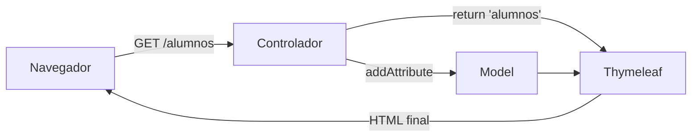

# 5. La vista y el modelo con Thymeleaf

Hasta ahora, nuestros controladores han devuelto texto plano con `@ResponseBody`. Una aplicación web
real devuelve páginas HTML completas, y para eso entra en juego la **vista**, la tercera pieza del
patrón MVC. En esta página vemos qué es una vista, cómo trabaja Thymeleaf y cómo el controlador le
pasa los datos que debe mostrar.

## 5.1. La vista en Spring MVC

La **vista** es la parte de la aplicación que decide **cómo se presentan** los datos al usuario. En
nuestro caso será una **plantilla HTML** que Spring rellena con datos antes de enviarla al
navegador.

Para rellenar la plantilla se usa un **motor de plantillas** (*template engine*): un componente que
lee un archivo HTML con marcas especiales, sustituye esas marcas por datos reales y devuelve el HTML
final. Existen varios (Thymeleaf, FreeMarker, Mustache...); en esta unidad usaremos **Thymeleaf**,
que es el que Spring Boot recomienda y mejor integrado tiene.

El recorrido completo de una petición con vista queda así:



1. El navegador hace la petición.
2. El controlador prepara los datos y los deja en el **modelo**.
3. El controlador devuelve el **nombre de la plantilla**.
4. Thymeleaf combina la plantilla con los datos del modelo y genera el HTML.
5. Ese HTML es la respuesta que recibe el navegador.

### Diferencia con `@ResponseBody`

| | Con `@ResponseBody` | Sin `@ResponseBody` (vista) |
|---|---|---|
| Qué significa el `String` devuelto | Es la respuesta HTTP tal cual | Es el **nombre de una plantilla** |
| Quién genera el HTML | El programador, a mano | Thymeleaf, a partir de la plantilla |
| Uso típico | Pruebas, texto, datos | Páginas web |

:::note
`@RestController`
Una clase anotada con `@RestController` equivale a `@Controller` con `@ResponseBody` en todos sus
métodos: el `String` devuelto siempre es la respuesta final, nunca el nombre de una vista. Para
devolver plantillas hay que usar `@Controller`.
:::

## 5.2. Thymeleaf: HTML "natural"

Lo que distingue a Thymeleaf de otros motores es que sus plantillas son **HTML válido**. Las marcas
especiales se escriben como atributos con el prefijo `th:`, que un navegador ignora al no
reconocerlos.

```html
<p th:text="${mensaje}">Texto de ejemplo</p>
```

- Si abres el archivo directamente en el navegador (sin servidor), verás **Texto de ejemplo**.
- Si Spring procesa la plantilla, `th:text` sustituye el contenido de la etiqueta por el valor de
  `mensaje`, y el resultado será, por ejemplo, `<p>Hola desde el servidor</p>`.

A esta característica se le llama plantilla **natural**: el diseñador puede trabajar con el HTML
estático y el programador añadir la parte dinámica sobre el mismo archivo, sin que se estorben.

## 5.3. Puesta en marcha

### Dependencia

Si al generar el proyecto con Spring Initializr marcaste la dependencia **Thymeleaf**, ya está
todo listo. En caso contrario, hay que añadir en el `pom.xml`:

```xml
<dependency>
    <groupId>org.springframework.boot</groupId>
    <artifactId>spring-boot-starter-thymeleaf</artifactId>
</dependency>
```

Spring Boot detecta el *starter* y **autoconfigura** Thymeleaf: no hace falta ninguna otra
configuración para empezar a usarlo.

### Dónde van las plantillas

Las plantillas son archivos `.html` dentro de la carpeta:

```text
src/main/resources/templates/
```

### Desactivar la caché durante el desarrollo

Por defecto, Thymeleaf guarda en memoria las plantillas ya procesadas. Mientras desarrollamos
resulta incómodo, porque los cambios en un `.html` no se ven hasta reiniciar. Para evitarlo, en
`application.properties`:

```properties
spring.thymeleaf.cache=false
```

:::note
Solo en desarrollo
En una aplicación en producción conviene dejar la caché activada (es el valor por defecto), ya que
mejora el rendimiento.
:::

## 5.4. Cómo se resuelve el nombre de la vista

Cuando un método del controlador devuelve un `String`, Spring lo interpreta como el nombre de la
vista y lo completa con un **prefijo** y un **sufijo** para localizar el archivo:

| Parte | Valor por defecto |
|---|---|
| Prefijo | `classpath:/templates/` |
| Sufijo | `.html` |

```java
return "alumnos";        // busca templates/alumnos.html
return "admin/panel";    // busca templates/admin/panel.html
```

Por tanto, el nombre se escribe **sin extensión** y, si la plantilla está en una subcarpeta, se
incluye la ruta relativa a `templates`.

:::warning
Si el método devuelve un nombre para el que no existe plantilla, la aplicación responde con un
error 500 y en la consola aparece un mensaje del tipo `Error resolving template [alumnos]`.
Revisa que el nombre coincide con el del archivo (mayúsculas incluidas) y que está dentro de
`templates`.
:::

## 5.5. Primer ejemplo completo

Controlador:

```java
package es.centro.miproyecto.controllers;

import org.springframework.stereotype.Controller;
import org.springframework.ui.Model;
import org.springframework.web.bind.annotation.GetMapping;

@Controller
public class InicioController {

    @GetMapping("/inicio")
    public String inicio(Model model) {
        model.addAttribute("mensaje", "Bienvenido a la aplicación");
        return "inicio"; // templates/inicio.html
    }
}
```

Plantilla `src/main/resources/templates/inicio.html`:

```html
<!DOCTYPE html>
<html xmlns:th="http://www.thymeleaf.org">
<head>
    <meta charset="UTF-8">
    <title>Inicio</title>
</head>
<body>
    <h1 th:text="${mensaje}">Mensaje de ejemplo</h1>
</body>
</html>
```

Al visitar `http://localhost:8080/inicio`, el navegador recibe:

```html
<h1>Bienvenido a la aplicación</h1>
```

## 5.6. El modelo: paso de datos a la vista

El **modelo** es el "paquete" de datos que el controlador prepara para la vista. Se recibe como
parámetro del método (Spring lo crea y lo inyecta) y se rellena con `addAttribute`:

```java
model.addAttribute("clave", valor);
```

- **La clave** es el nombre con el que la plantilla podrá acceder al dato.
- **El valor** puede ser cualquier objeto Java.

En la plantilla, el dato se recupera con esa misma clave: `${clave}`.

### Tipos de datos que se pueden enviar

Prácticamente cualquier cosa: textos, números, booleanos, objetos propios y colecciones. Como
ejemplo, usaremos una clase de dominio sencilla:

```java
package es.centro.miproyecto.models;

public class Alumno {

    private int id;
    private String nombre;
    private String curso;
    private int edad;

    public Alumno(int id, String nombre, String curso, int edad) {
        this.id = id;
        this.nombre = nombre;
        this.curso = curso;
        this.edad = edad;
    }

    public int getId() { return id; }
    public String getNombre() { return nombre; }
    public String getCurso() { return curso; }
    public int getEdad() { return edad; }
}
```

Y un controlador que envía un texto, un objeto y una lista:

```java
@Controller
@RequestMapping("/alumnos")
public class AlumnosController {

    @GetMapping("/{id}")
    public String detalle(@PathVariable int id, Model model) {
        Alumno alumno = new Alumno(id, "Lucía Márquez", "2DAW", 19);

        model.addAttribute("titulo", "Ficha del alumno");   // un texto
        model.addAttribute("alumno", alumno);                // un objeto
        return "alumno-detalle";
    }

    @GetMapping
    public String listar(Model model) {
        List<Alumno> alumnos = List.of(
                new Alumno(1, "Lucía Márquez", "2DAW", 19),
                new Alumno(2, "Marcos Iglesias", "1DAM", 18));

        model.addAttribute("alumnos", alumnos);              // una lista
        return "alumnos";
    }
}
```

Plantilla `alumno-detalle.html`:

```html
<h1 th:text="${titulo}">Título</h1>
<p>Nombre: <span th:text="${alumno.nombre}">Nombre</span></p>
<p>Curso: <span th:text="${alumno.curso}">Curso</span></p>
```

`${alumno.nombre}` accede a la propiedad `nombre` del objeto: Thymeleaf llama por debajo al
método `getNombre()`. La sintaxis de las expresiones se explica con detalle en la siguiente página,
y la forma de recorrer una lista como `alumnos` en la página de estructuras de control.

:::note
Los atributos solo viven durante esa petición
Lo que se guarda en el modelo está disponible únicamente para la plantilla que se renderiza en
esa misma petición. En la petición siguiente, el modelo empieza vacío de nuevo.
:::

## 5.7. `ModelAndView`: la alternativa

Existe otra forma de devolver vista y datos a la vez: en lugar de recibir `Model` por parámetro y
devolver un `String`, el método devuelve un objeto `ModelAndView` que contiene ambas cosas.

```java
@GetMapping("/resumen")
public ModelAndView resumen() {
    ModelAndView mav = new ModelAndView("resumen");   // nombre de la vista
    mav.addObject("titulo", "Resumen del curso");       // datos
    return mav;
}
```

| | `Model` + `String` | `ModelAndView` |
|---|---|---|
| Nombre de la vista | Se devuelve como `String` | Se pasa al construir el objeto |
| Datos | `model.addAttribute(...)` | `mav.addObject(...)` |
| Uso habitual | El más extendido y más cómodo | Menos frecuente |

En esta unidad usaremos siempre la primera forma (`Model` + `String`).

## 5.8. Redirecciones y *forwards*

A veces un método del controlador no debe mostrar ninguna vista, sino **enviar la petición a otra
ruta**. El `String` devuelto admite dos prefijos especiales para esto:

```java
@GetMapping("/")
public String raiz() {
    return "redirect:/alumnos";   // redirección
}

@GetMapping("/antiguo")
public String rutaAntigua() {
    return "forward:/alumnos";    // forward
}
```

| | `redirect:` | `forward:` |
|---|---|---|
| Qué ocurre | El servidor responde al navegador que haga **una nueva petición** a la otra ruta | El servidor pasa la petición a la otra ruta **internamente** |
| URL en el navegador | Cambia a la nueva ruta | Se mantiene la original |
| Nº de peticiones | 2 | 1 |
| Datos del modelo | No se conservan | Se conservan |
| Uso habitual | Tras completar una acción, llevar al usuario a otra página | Reutilizar la lógica de otro controlador |

:::note
Cuál usar
En la práctica, `redirect:` es con diferencia el más habitual. Cuando veamos los formularios
se aplicará constantemente: tras procesar un envío, se redirige a otra página para que, si el
usuario recarga, el navegador no repita el envío.
:::