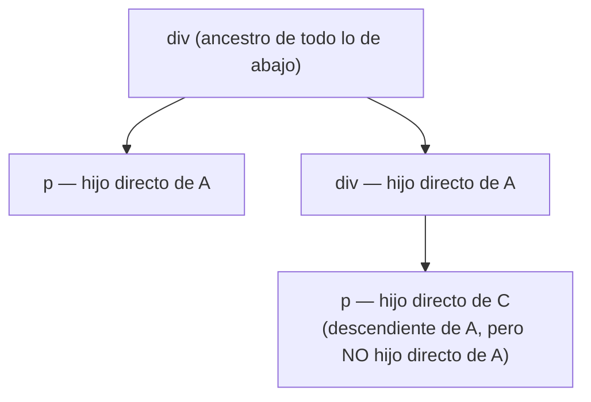
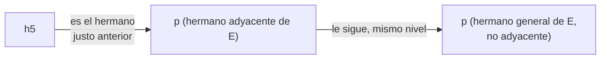

import HtmlCssPlayground from '@site/src/components/Playground/HtmlCssPlayground';

Un selector es la parte de una regla CSS que indica a qué elementos se aplican las declaraciones. Ya hemos usado el selector de tipo (`p`, `h2`...) en la página anterior; aquí veremos los demás tipos de selectores, cómo combinarlos y qué hace el navegador cuando varias reglas afectan al mismo elemento.

## Selector universal

El selector `*` selecciona **todos** los elementos del documento. Se usa sobre todo para aplicar un reseteo general, como quitar los márgenes por defecto que el navegador pone a algunos elementos.

<HtmlCssPlayground
  initialHtml={`<h2>Título</h2>
<p>Párrafo de ejemplo.</p>
<span>Un span</span>`}
  initialCss={`* {
    color: darkslateblue;
}`}
/>

## Selector de tipo

Selecciona todos los elementos de una misma etiqueta HTML. Ya lo hemos usado en la página anterior:

<HtmlCssPlayground
  initialHtml={`<p>Primer párrafo.</p>
<p>Segundo párrafo.</p>`}
  initialCss={`p {
    color: teal;
}`}
/>

## Selector de clase

Selecciona los elementos que tienen un atributo `class` con ese valor. Se escribe con un punto delante del nombre de la clase. Un mismo elemento puede tener varias clases, separadas por espacios, y una misma clase se puede reutilizar en elementos distintos.

<HtmlCssPlayground
  initialHtml={`<p class="destacado">Este párrafo está destacado.</p>
<p>Este no.</p>
<span class="destacado">Este span también está destacado.</span>`}
  initialCss={`.destacado {
    background-color: yellow;
    font-weight: bold;
}`}
/>

Se puede combinar el selector de tipo con el de clase, sin espacio entre ambos, para seleccionar solo los elementos de ese tipo que además tengan esa clase:

<HtmlCssPlayground
  initialHtml={`<p class="destacado">Párrafo destacado.</p>
<span class="destacado">Span destacado (no cambia).</span>`}
  initialCss={`p.destacado {
    background-color: yellow;
}`}
/>

## Selector de id

Selecciona el elemento que tiene un atributo `id` con ese valor. Se escribe con una almohadilla delante del nombre. A diferencia de `class`, el valor de `id` **debe ser único** en todo el documento: solo puede haber un elemento con cada id.

<HtmlCssPlayground
  initialHtml={`<p id="aviso">Este párrafo tiene un id único.</p>
<p>Este no.</p>`}
  initialCss={`#aviso {
    border: 2px solid red;
    padding: 8px;
}`}
/>

:::tip
Como un `id` también sirve para enlazar con `<label for="...">` o con anclas (`#aviso` en una URL), conviene reservarlo para eso y usar `class` para dar estilo, salvo que de verdad sea un elemento único de la página (una cabecera, un pie...).
:::

## Selector de atributo

Selecciona elementos según si tienen un atributo, o según su valor. Es útil, por ejemplo, para dar estilo a distintos tipos de `<input>` sin necesidad de añadirles una clase.

<HtmlCssPlayground
  initialHtml={`<input type="text" placeholder="Texto" />
<input type="email" placeholder="Email" />
<input type="checkbox" />`}
  initialCss={`input[type="text"] {
    border: 2px solid teal;
}

input[type="email"] {
    border: 2px solid darkorange;
}`}
/>

Algunas variantes del selector de atributo:

- `[atributo]`: tiene ese atributo, con cualquier valor.
- `[atributo="valor"]`: el valor es exactamente ese.
- `[atributo^="valor"]`: el valor empieza por esa cadena.
- `[atributo$="valor"]`: el valor termina en esa cadena.
- `[atributo*="valor"]`: el valor contiene esa cadena en cualquier posición.

## Agrupar selectores

Como vimos en la página anterior, se pueden agrupar varios selectores separándolos por comas para aplicarles las mismas declaraciones sin repetir el bloque:

<HtmlCssPlayground
  initialHtml={`<h2>Título</h2>
<p class="destacado">Párrafo destacado.</p>`}
  initialCss={`h2, .destacado {
    color: darkred;
}`}
/>

## Combinadores

Los combinadores relacionan dos selectores según la posición de los elementos en el HTML. Esa posición se suele describir con los mismos términos que un árbol genealógico: un elemento puede ser **ancestro** o **descendiente** de otro (a cualquier nivel), **padre** o **hijo** (nivel inmediato), o **hermano** de otro (mismo nivel, mismo padre).



Los hermanos, en cambio, no son una relación de contención, sino de orden al mismo nivel:



### Descendiente (espacio)

Selecciona los elementos que están dentro de otro, a cualquier nivel de profundidad (hijos, nietos...).

<HtmlCssPlayground
  initialHtml={`<div class="caja">
    <p>Párrafo dentro de la caja.</p>
    <section>
        <p>Párrafo dentro de una sección, dentro de la caja.</p>
    </section>
</div>
<p>Párrafo fuera de la caja (no cambia).</p>`}
  initialCss={`.caja p {
    color: teal;
}`}
/>

### Hijo directo (`>`)

Selecciona solo los elementos que son hijos directos del primero, sin entrar en más niveles.

<HtmlCssPlayground
  initialHtml={`<div class="caja">
    <p>Hijo directo de la caja.</p>
    <section>
        <p>Nieto de la caja (no cambia).</p>
    </section>
</div>`}
  initialCss={`.caja > p {
    color: teal;
}`}
/>

### Hermano adyacente (`+`)

Selecciona el elemento que va justo después de otro, al mismo nivel.

<HtmlCssPlayground
  initialHtml={`<h2>Título</h2>
<p>Este párrafo va justo después del título.</p>
<p>Este no va justo después, va justo después del otro párrafo.</p>`}
  initialCss={`h2 + p {
    color: teal;
    font-weight: bold;
}`}
/>

### Hermano general (`~`)

Selecciona todos los elementos que van después de otro y al mismo nivel, no solo el siguiente.

<HtmlCssPlayground
  initialHtml={`<h2>Título</h2>
<p>Primer párrafo después del título.</p>
<p>Segundo párrafo después del título.</p>`}
  initialCss={`h2 ~ p {
    color: teal;
}`}
/>

### Universal dentro de un combinador (`A *`)

El selector universal (`*`) también se puede combinar con el descendiente: `div *` selecciona **todos** los elementos que están dentro de un `div`, sea cual sea su etiqueta.

<HtmlCssPlayground
  initialHtml={`<div class="caja">
    <p>Un párrafo.</p>
    <a href="#">Un enlace.</a>
    <strong>Un strong.</strong>
</div>
<p>Este párrafo está fuera de la caja (no cambia).</p>`}
  initialCss={`.caja * {
    text-decoration: underline dotted;
}`}
/>

### Tabla resumen

| Combinador | Sintaxis | Selecciona |
|---|---|---|
| Descendiente | `A B` | B dentro de A, a cualquier nivel |
| Hijo directo | `A > B` | B que es hijo directo de A |
| Hermano adyacente | `A + B` | B justo después de A, mismo nivel |
| Hermano general | `A ~ B` | Todos los B después de A, mismo nivel |
| Universal dentro de A | `A *` | Todos los elementos dentro de A, de cualquier tipo |

### Pon a prueba lo aprendido

Antes de ver el resultado, lee este HTML y este CSS y, para cada párrafo y cada enlace, intenta adivinar qué estilo (o estilos) se le aplican y por qué selector.

```html
<div class="contenedor">
    <p>Este es un párrafo dentro de un div (estilo descendente y de hijo directo).</p>

    <div class="subcontenedor">
        <p>Este es un párrafo dentro de un div anidado (estilo descendente).</p>
    </div>
    <span>
        <p>Párrafo hijo no directo de un div (estilo descendente).</p>
    </span>
    <a href="#inicio">Este es un enlace, también se ve afectado por el combinador universal.</a>
</div>

<h5>Subtítulo con párrafo adyacente</h5>
<p>Este es un párrafo adyacente a un <code>&lt;h5&gt;</code> (estilo adyacente).</p>
<p>Este es otro párrafo, no es adyacente al <code>&lt;h5&gt;</code>, por lo que no se le aplica el estilo adyacente.</p>

<h6>Subtítulo con hermanos generales</h6>
<p>Primer párrafo hermano de un <code>&lt;h6&gt;</code> (estilo de hermanos generales).</p>
<p>Segundo párrafo hermano de un <code>&lt;h6&gt;</code> (estilo de hermanos generales).</p>
<div>
    <p>Este es otro párrafo dentro de un <code>&lt;div&gt;</code> anidado, sin el estilo de hermanos generales.</p>
</div>
```

```css
/* Selector descendente: aplica a todos los <p> dentro de un <div>, en cualquier nivel */
div p {
    background-color: rgb(148, 148, 248);
}

/* Selector de hijo directo: aplica solo a los <p> que son hijos directos de un <div> */
div > p {
    font-style: italic;
}

/* Selector adyacente: aplica al <p> que sigue inmediatamente después de un <h5> */
h5 + p {
    background-color: rgb(122, 212, 122);
}

/* Selector de hermanos generales: aplica a todos los <p> que son hermanos de un <h6> */
h6 ~ p {
    background-color: rgb(212, 122, 122);
}

/* Selector universal: aplica a todas las etiquetas contenidas dentro del <div> */
div * {
    text-decoration: underline dotted;
}
```

<details>
  <summary>Comprueba tu respuesta</summary>

  - El primer `<p>` (hijo directo de `.contenedor`) recibe fondo azulado (`div p`, descendiente) **y** cursiva (`div > p`, hijo directo de un div): cumple las dos condiciones.
  - El `<p>` dentro de `.subcontenedor` también recibe fondo azulado **y** cursiva: es descendiente de `.contenedor` (fondo) y, a la vez, hijo directo de `.subcontenedor`, que también es un `div` (cursiva).
  - El `<p>` dentro del `<span>` recibe fondo azulado (es descendiente de `.contenedor`, aunque esté más anidado), pero **no** cursiva: su padre directo es `<span>`, no un `<div>`.
  - El `<a>` no recibe fondo ni cursiva (no es un `<p>`), pero sí el subrayado punteado de `.contenedor *`, igual que los tres `<p>` anteriores.
  - El primer `<p>` después de `<h5>` recibe fondo verdoso (`h5 + p`): es el hermano inmediatamente siguiente.
  - El segundo `<p>` después de `<h5>` **no** recibe fondo verdoso: ya no es adyacente a `<h5>`, es adyacente al `<p>` anterior.
  - Los dos `<p>` hermanos de `<h6>` reciben fondo rojizo (`h6 ~ p`): el combinador general no exige que sean el siguiente inmediato, solo que vengan después y al mismo nivel.
  - El `<p>` dentro del último `<div>` no recibe fondo rojizo: no es hermano de `<h6>`, es descendiente de un `<div>` que sí lo es.
</details>

Ahora compruébalo en vivo:

<HtmlCssPlayground
  initialHtml={`<div class="contenedor">
    <p>Este es un párrafo dentro de un div (estilo descendente y de hijo directo).</p>

    <div class="subcontenedor">
        <p>Este es un párrafo dentro de un div anidado (estilo descendente).</p>
    </div>
    <span>
        <p>Párrafo hijo no directo de un div (estilo descendente).</p>
    </span>
    <a href="#inicio">Este es un enlace, también se ve afectado por el combinador universal.</a>
</div>

<h5>Subtítulo con párrafo adyacente</h5>
<p>Este es un párrafo adyacente a un <code>&lt;h5&gt;</code> (estilo adyacente).</p>
<p>Este es otro párrafo, no es adyacente al <code>&lt;h5&gt;</code>, por lo que no se le aplica el estilo adyacente.</p>

<h6>Subtítulo con hermanos generales</h6>
<p>Primer párrafo hermano de un <code>&lt;h6&gt;</code> (estilo de hermanos generales).</p>
<p>Segundo párrafo hermano de un <code>&lt;h6&gt;</code> (estilo de hermanos generales).</p>
<div>
    <p>Este es otro párrafo dentro de un <code>&lt;div&gt;</code> anidado, sin el estilo de hermanos generales.</p>
</div>`}
  initialCss={`div p {
    background-color: rgb(148, 148, 248);
}

div > p {
    font-style: italic;
}

h5 + p {
    background-color: rgb(122, 212, 122);
}

h6 ~ p {
    background-color: rgb(212, 122, 122);
}

div * {
    text-decoration: underline dotted;
}`}
  layout="stacked"
/>

## Especificidad: qué regla gana

En la página anterior vimos que, si dos reglas afectan a lo mismo, gana la que está más abajo. Pero eso solo es así cuando ambas reglas tienen la misma **especificidad**: un valor que mide cómo de concreto es un selector. A mayor especificidad, más "peso" tiene la regla, gane o no por orden.

De menor a mayor especificidad:

1. Selector universal (`*`) y combinadores (no suman especificidad por sí mismos).
2. Selectores de tipo (`p`) y pseudoelementos (`::before`).
3. Selectores de clase (`.destacado`), de atributo (`[type="text"]`) y pseudoclases (`:hover`).
4. Selectores de id (`#aviso`).
5. Estilos en línea (`style="..."` sobre el propio elemento).

Un selector compuesto suma la especificidad de cada una de sus partes. Por ejemplo, `.caja p` (una clase + un tipo) es más específico que `p` solo, aunque `p` aparezca después en el CSS:

<HtmlCssPlayground
  initialHtml={`<div class="caja">
    <p>¿De qué color será este párrafo?</p>
</div>`}
  initialCss={`.caja p {
    color: teal;
}

p {
    color: red;
}`}
/>

Aunque `p { color: red; }` está más abajo, `.caja p` tiene más especificidad (una clase y un tipo, frente a un solo tipo) y gana.

### `!important`

Añadiendo `!important` después del valor, una declaración ignora las reglas de especificidad y gana siempre (salvo que otra regla también tenga `!important`, en cuyo caso se vuelve a aplicar la especificidad entre ellas).

<HtmlCssPlayground
  initialHtml={`<p id="aviso" class="destacado">Texto de ejemplo.</p>`}
  initialCss={`#aviso {
    color: red;
}

.destacado {
    color: green !important;
}`}
/>

:::warning
`!important` se debería evitar en la medida de lo posible: hace que el CSS sea más difícil de mantener, porque una regla con `!important` solo se puede "ganar" con otra regla también marcada como `!important`, y eso acaba generando una escalada de `!important` por todo el proyecto. Úsalo solo como último recurso.
:::

## Resumen: el orden completo de la cascada

Cuando el navegador decide qué regla aplicar, lo hace en este orden:

1. **Origen:** los estilos del propio navegador pierden frente a los del desarrollador; dentro de los del desarrollador, `!important` tiene prioridad sobre el resto.
2. **Especificidad:** id > clase/atributo/pseudoclase > tipo/pseudoelemento, sumando las partes de selectores compuestos.
3. **Orden de aparición:** a igualdad de especificidad, gana la última regla declarada.

En la siguiente página veremos las pseudoclases y los pseudoelementos con más detalle.