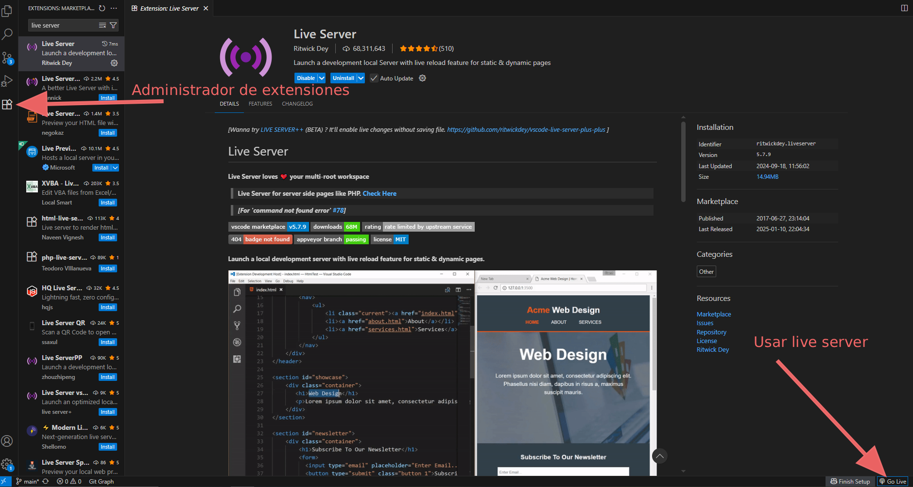

# Introducción a los lenguajes de marcas
Conceptos básicos, por qué importan y qué construiremos a partir de ellos.
## ¿Qué es un *lenguaje de marcas*?
Un **lenguaje de marcas** es un conjunto de reglas y etiquetas que se usan para describir la estructura y el significado de un documento. A diferencia de los lenguajes de programación, su objetivo principal es *marcar* la información (por ejemplo: títulos, párrafos, listas, enlaces) para que otros sistemas —navegadores, procesadores, transformadores— puedan interpretarla y mostrarla correctamente.
### Ejemplo de HTML
```html
<!doctype html>
<html>
<head><title>Mi página</title></head>
<body>
<h1>Hola mundo</h1>
<p>Esto es contenido marcado.</p>
</body>
</html>
```
## ¿Por qué son importantes?
- **Interoperabilidad:** Permiten que diferentes programas entiendan y procesen los mismos datos.
- **Accesibilidad:** Estructurar bien el contenido ayuda a tecnologías de asistencia (lectores de pantalla, buscadores).
- **Separación de contenido y presentación:** El marcado describe *qué* es cada cosa; los estilos y scripts controlan *cómo* se ve o se comporta.
- **Reutilización y transformación:** El mismo documento marcado puede convertirse en PDF, página web, datos para una API o ser transformado con XSL/plantillas.
## Durante el curso...
Aprenderemos a utilizar HTML y CSS para construir páginas web estáticas como base fundamental para estructurar y presentar la información en la web. Nuestro objetivo será comprender cómo organizar un documento correctamente y cómo darle estilo
Aprenderemos a utilizar JavaScript para construir páginas web dinámicas, con funcionalidad. Nos iniciaremos en el mundo de la programación web

Aprenderemos a utilizar XML para organizar información y lo trasladaremos a la web. Podremos realizar búsquedas, transformaciones y comprobaciones.

## Materiales y herramienta mínima
**Herramientas de trabajo**
| # | Herramienta | Descripción |
| --- | --- | --- |
| 1 | [**Visual Studio Code (VSC)**](https://code.visualstudio.com/) | Editor de código recomendado: ligero, extensible y muy usado en el desarrollo web. |
| 2 | **Extensión: Live Server** | Permite lanzar un servidor local y recargar automáticamente la página cuando guardes cambios —ideal para ver resultados instantáneos. |
| 3 | **Extensiones opcionales** | - **Prettier** — formateo automático de código. - **Bracket Pair Colorizer** — colores para pares de etiquetas y paréntesis. - **Auto Rename Tag** — renombra la etiqueta de cierre junto con la de apertura |

