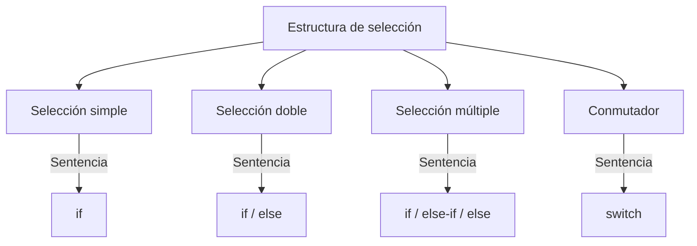
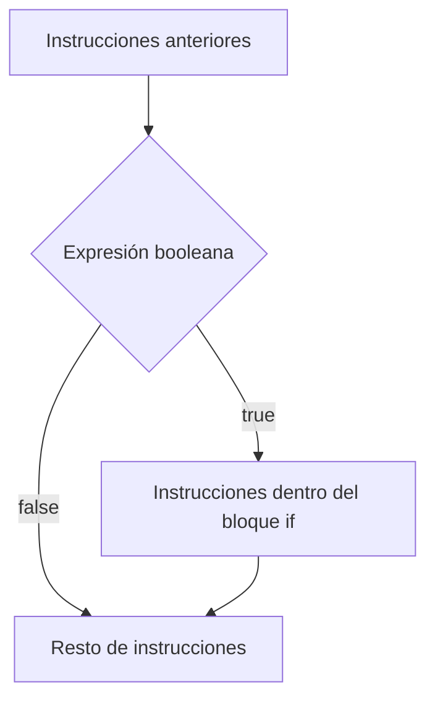
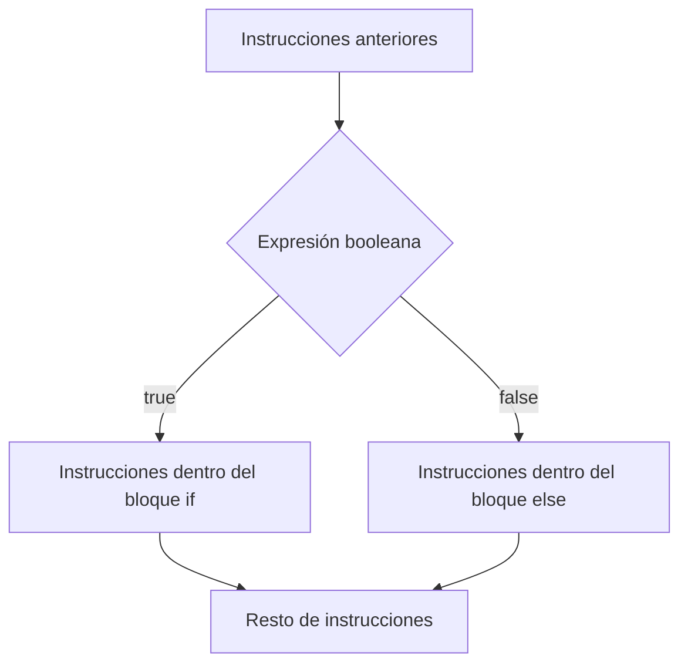
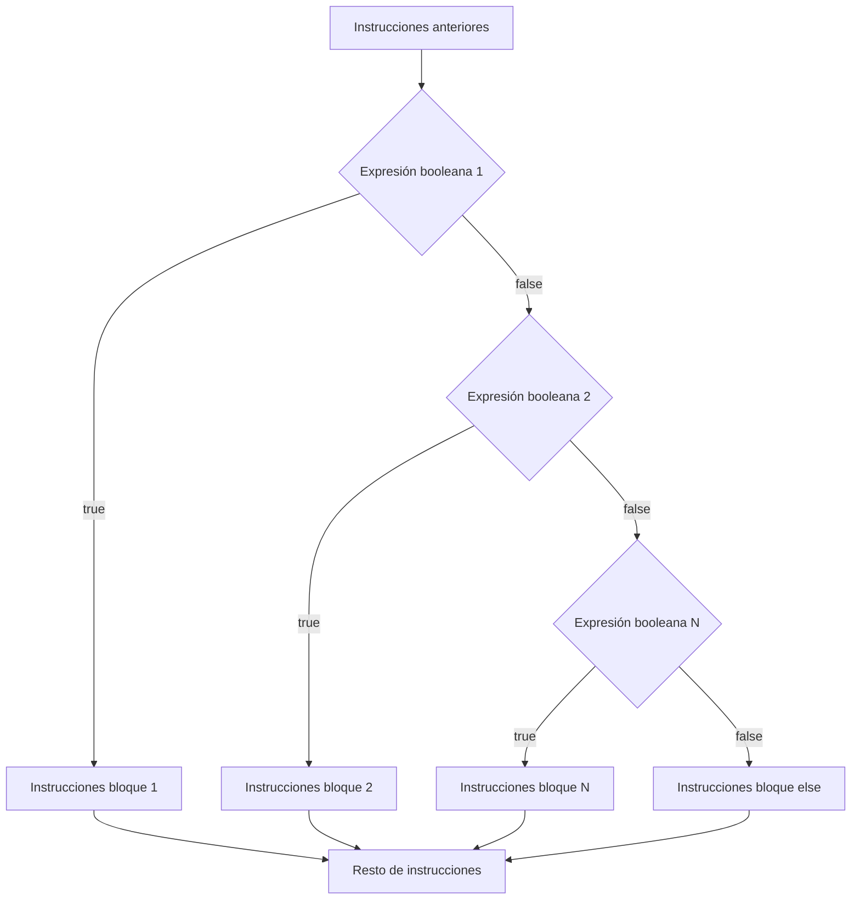
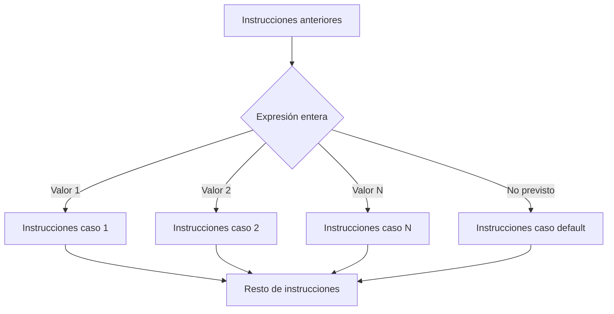

Las **estructuras de selección** permiten tomar decisiones sobre qué conjunto de instrucciones ejecutar en un punto del programa. O sea, seleccionar qué código se ejecuta en un momento determinado entre caminos alternativos.



## Selección simple

La estructura de **selección simple** permite controlar el hecho de que se ejecute un conjunto de instrucciones si y sólo si se cumple la condición lógica (es decir, el resultado de evaluar la condición lógica es igual a `true`). En caso contrario, no se ejecutan.

```java
Instrucciones anteriores ...
if (expresión booleana) {
    sentencia1;
    sentencia2;
    //...
    sentenciaN;
}
Resto de instrucciones ...
```



### Ejemplo

```java
import java.util.Scanner;
// Un programa que calcula descuentos.
public class Descuento {
    // Se hace un descuento del 8%.
    public static final float DESCUENTO = 8;
    // Se hace descuento por compras de un mínimo de 50 euros.
    public static final float COMPRA_MIN = 50;

    public static void main(String[] args) {
        System.out.println("¿Cuál es el precio del producto, en euros?");
        var lector = new Scanner(System.in);
        float precio = lector.nextFloat();
        lector.nextLine();

        // Estructura de selección simple.
        // Si la expresión evalúa true, ejecuta el bloque dentro del if.
        // En caso contrario se ignora.
        if (precio >= COMPRA_MIN) {
            float descuento = precio * DESCUENTO / 100;
            precio = precio - descuento;
        }

        System.out.println("El precio final a pagar es de " + precio + " euros.");
    }
}
```

## Selección doble

La estructura de **selección doble** permite controlar el hecho de que se ejecute un conjunto de instrucciones sólo si se cumple la condición lógica, y que se ejecute otro conjunto sólo si no se cumple.

```java
... Instrucciones anteriores

if (expresión booleana) {
    Instrucciones si la expresión booleana es true;
    Bloque if;
}
else {
    Instrucciones si la expresión booleana es false;
    Bloque else;
}
Resto de instrucciones ...
```



### Ejemplo

```java
import java.util.Scanner;
// Un programa en el que hay que adivinar un número.
public class Adivina {
    // El valor a adivinar será el 4.
    public static final int VALOR = 4;

    public static void main(String[] args) {
        System.out.println("Comienza el juego.");
        System.out.println("Adivina el valor entero, entre 0 y 10:");

        Scanner lector = new Scanner(System.in);
        int valorint = lector.nextInt();
        lector.nextLine();

        // Estructura de selección doble.
        // O adivina o se falla.
        if (VALOR == valorint) {
            // Si la expresión evalúa true, ejecuta el bloque dentro del if.
            System.out.println("Exacto! Era " + VALOR + ".");
        } else {
            // Si la expresión evalúa false, ejecuta el bloque dentro del else.
            System.out.println("Te has equivocado!");
        }
        System.out.println("Hemos terminado el juego.");
    }
}
```

## Selección múltiple

La estructura de **selección múltiple** permite controlar el hecho de que, al cumplirse un caso entre un conjunto finito de casos, se ejecute el conjunto de instrucciones correspondiente. Se construye encadenando bloques `else if`.

```java
... Instrucciones del programa
if (expresión booleana 1) {
    Instrucciones si la 1ª expresión booleana es true;
}
else if (expresión booleana 2) {
    Instrucciones si la expresión booleana 2 es true;
}
else if (expresión booleana 3) {
    Instrucciones si la expresión booleana 3 es true;
}
// ... se repite la secuencia tantas veces como sea necesario ...
else if (expresión booleana N) {
    Instrucciones si la expresión booleana N es true;
}
else {
    Instrucciones si todas las expresiones booleanas son false;
}
... Resto de instrucciones del programa
```



:::note
Las condiciones se evalúan **en orden**, de arriba a abajo, y en cuanto una se cumple, se ejecuta su bloque y se ignoran el resto. El bloque `else` final es opcional y recoge el caso en que ninguna condición anterior se ha cumplido.
:::

### Ejemplo

```java
import java.util.Scanner;
// Un programa que indica la nota en texto a partir de la numérica.
public class Nota {
    public static void main(String[] args) {
        Scanner lector = new Scanner(System.in);
        System.out.println("¿Qué nota has sacado?");
        float nota = lector.nextFloat();
        lector.nextLine();

        // Estructura de selección múltiple.
        // Se entra en el bloque donde la condición lógica evalúe a true.
        // Si ninguno lo hace, se entra en el bloque else.
        System.out.print("Tu nota final es ");
        if ((nota >= 9) && (nota <= 10)) {
            System.out.println("Sobresaliente.");
        } else if ((nota >= 7) && (nota < 9)) {
            System.out.println("Notable.");
        } else if ((nota >= 5) && (nota < 7)) {
            System.out.println("Aprobado.");
        } else {
            System.out.println("Suspenso.");
        }
        System.out.println("Espero que haya ido bien ...");
    }
}
```

## Combinación de estructuras

Las estructuras de selección se pueden **anidar** unas dentro de otras (un `if` dentro de otro `if`, por ejemplo), creando distintos niveles de anidamiento. Cada nivel se ejecuta solo si se ha entrado en el nivel anterior.

```java
import java.util.Scanner;
// Un programa que calcula descuentos.
public class DescuentoModificado {
    public static final float DESCUENTO = 8;
    public static final float COMPRA_MIN = 50;
    // Se hace descuento máximo de 10 euros.
    public static final float DESC_MAX = 10;

    public static void main(String[] args) {
        System.out.println("¿Cuál es el precio del producto, en euros?");
        var lector = new Scanner(System.in);
        float precio = lector.nextFloat();
        lector.nextLine();

        // 1er nivel: comprobar si el precio es positivo.
        if (precio > 0) {
            // 2º nivel: comprobar si llega al mínimo de compra.
            if (precio >= COMPRA_MIN) {
                float descuento = precio * DESCUENTO / 100;
                // 3er nivel: comprobar si el descuento supera el máximo.
                if (descuento > DESC_MAX) {
                    descuento = DESC_MAX;
                }
                precio = precio - descuento;
            }
            System.out.println("El precio final a pagar es de " + precio + " euros.");
        } else {
            // El precio era negativo. Hay que avisar al usuario.
            System.out.println("Precio incorrecto. Es negativo.");
        }
    }
}
```

:::tip[Legibilidad del código]
Cuantos más niveles de anidamiento tiene un bloque de código, más difícil resulta de leer y mantener. Cuando el anidamiento crece demasiado, suele ser buena idea extraer parte de la lógica a un método aparte.
:::

## Conmutador `switch`

La estructura **Conmutador** permite controlar el hecho de que, al cumplirse un caso entre un conjunto finito de casos, se ejecute el conjunto de instrucciones correspondiente, siendo la expresión a evaluar de tipo entero o carácter (también admite `String` y `enum`).

```java
... Instrucciones anteriores

switch (expresión de tipo entero) {
    case valor1:
        Instrucciones si la expresión evalúa el valor1;
        break; // opcional
    case valor2:
        Instrucciones si la expresión evalúa el valor2;
        break; // opcional
    // ...
    case valorN:
        Instrucciones si la expresión evalúa el valorN;
        break; // opcional
    default:
        Instrucciones si la expresión no evalúa ninguno de los valores anteriores;
}

Resto de instrucciones ...
```



:::warning[No olvides el `break`]
Si no se coloca `break` al final de un `case`, la ejecución **continúa** con las instrucciones del siguiente `case`, aunque su valor no coincida con la expresión evaluada (esto se conoce como *fall-through*). Normalmente es un error, así que hay que acordarse de poner `break` salvo que se busque expresamente ese comportamiento.
:::

### Ejemplo

```java
import java.util.Scanner;
// Un programa que da diferentes opciones de cálculo.
public class Opciones {
    public static void main(String[] args) {
        Scanner lector = new Scanner(System.in);
        System.out.println("Introduce un valor entero:");
        int primerValor = Integer.parseInt(lector.next());
        lector.nextLine();
        System.out.println("Introduce otro:");
        int segundoValor = Integer.parseInt(lector.next());
        lector.nextLine();

        System.out.println("¿Qué operación quieres hacer?");
        System.out.println("[1] Sumar");
        System.out.println("[2] Restar");
        System.out.println("[3] Multiplicar");
        System.out.println("[4] Dividir");
        System.out.print("Seleccionar la opción [1-4]:");
        int opcion = Integer.parseInt(lector.next());
        lector.nextLine();
        int resultado = 0;

        switch (opcion) {
            case 1:
                System.out.print("Has elegido sumar ...");
                resultado = primerValor + segundoValor;
                break;
            case 2:
                System.out.print("Has elegido restar ...");
                resultado = primerValor - segundoValor;
                break;
            case 3:
                System.out.print("Has elegido multiplicar ...");
                resultado = primerValor * segundoValor;
                break;
            case 4:
                System.out.print("Has elegido dividir ...");
                resultado = primerValor / segundoValor;
                break;
            default:
                System.out.println("Opción no prevista.");
        }
        System.out.println("El resultado es " + resultado + ".");
    }
}
```