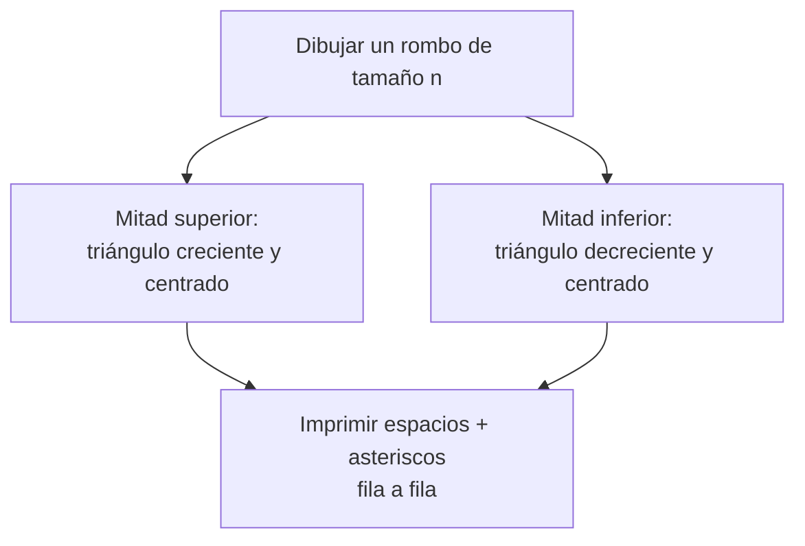

En esta página vamos a resolver, paso a paso, un ejercicio de bucles anidados algo más complejo que los que hemos visto hasta ahora.

La idea no es que copies una solución, sino que vayas construyendo tú mismo el programa fase a fase. Cada fase tiene una pequeña pista y, si te atascas, un desplegable con una pista más grande. La solución final **no aparece** en esta página: el objetivo es que la tengas tú, en tu editor, al terminar.

## Enunciado

Pide al usuario un número entero `n` (por ejemplo, `n = 4`) y dibuja un **rombo** hecho de asteriscos, centrado, como este:

```
   *
  ***
 *****
*******
 *****
  ***
   *
```

Fíjate en que el rombo tiene dos mitades: una mitad de arriba en la que cada fila tiene **dos asteriscos más** que la anterior, y una mitad de abajo que es el reflejo de la de arriba (sin repetir la fila central).

## Fase 0 — Entender y dividir el problema

Antes de escribir ni una línea de código, conviene **dividir el problema en partes más pequeñas**. Un rombo completo es, en realidad, la suma de dos problemas que ya se parecen a cosas que hemos hecho antes:



Así que en vez de atacar el rombo entero de golpe, vamos a resolver primero un triángulo sencillo, luego aprenderemos a centrarlo, y por último lo reflejaremos para formar el rombo completo.

## Fase 1 — Calentamiento: un triángulo simple

Antes de pensar en centrar nada, consigue imprimir un triángulo **sin centrar**, como este (para `n = 4`):

```
*
**
***
****
```

Vamos a construirlo en tres pasos muy pequeños, en vez de lanzarte directamente a escribir los dos bucles a la vez.

### Paso 1.1 — Solo el bucle exterior

Olvídate de momento de los asteriscos "variables". Pide `n` por teclado y consigue imprimir `n` líneas, todas iguales, por ejemplo una línea con un único asterisco cada vez:

```
*
*
*
*
```

<details>
<summary>💡 Pista</summary>

Esto es un único bucle, sin anidar todavía: se trata de repetir `n` veces la instrucción que imprime una línea.

</details>

<details>
<summary>💡 Pista más grande</summary>

```java
import java.util.Scanner;

public class Paso11 {
    public static void main(String[] args) {
        Scanner lector = new Scanner(System.in);
        System.out.println("¿Cuántas filas quieres?");
        int n = Integer.parseInt(lector.next());

        for (int fila = 1; fila <= n; fila++) {
            System.out.println("*");
        }
    }
}
```

</details>

### Paso 1.2 — Solo el bucle interior

Ahora olvídate del `n` y del bucle exterior. Fija a mano un valor, por ejemplo `fila = 3`, y consigue imprimir **una sola línea** con tantos asteriscos como indique esa variable, sin salto de línea entre ellos:

```
***
```

<details>
<summary>💡 Pista</summary>

Es otro bucle único, independiente del anterior: se trata de repetir `fila` veces la instrucción que imprime un asterisco, usando `print` (no `println`) para que no salte de línea entre uno y otro.

</details>

<details>
<summary>💡 Pista más grande</summary>

```java
int fila = 3;
for (int columna = 1; columna <= fila; columna++) {
    System.out.print("*");
}
System.out.println(); // este sí, para saltar de línea al terminar la fila
```

</details>

### Paso 1.3 — Combinar los dos bucles

Ya tienes por separado "repetir varias filas" (paso 1.1) y "pintar una fila con un número concreto de asteriscos" (paso 1.2). Ahora júntalos: en vez de que el paso 1.2 use un `fila` fijado a mano, debe usar la variable de control del bucle exterior del paso 1.1, de forma que la primera fila pinte 1 asterisco, la segunda 2, y así sucesivamente.

<details>
<summary>💡 Pista</summary>

El bucle del paso 1.2 pasa a estar **dentro** del bucle del paso 1.1. Lo único que cambia respecto al paso 1.2 es que, en vez del `3` fijo, el bucle interior debe llegar hasta el valor que tenga en ese momento la variable del bucle exterior.

</details>

<details>
<summary>💡 Pista más grande</summary>

```java
for (int fila = 1; fila <= n; fila++) {
    for (int columna = 1; columna <= fila; columna++) {
        System.out.print("*");
    }
    System.out.println();
}
```

</details>

:::tip
Antes de seguir, ejecuta tu programa con varios valores de `n` y asegúrate de que entiendes perfectamente por qué el bucle interior usa `fila` como condición de parada. Lo vas a necesitar en la siguiente fase.
:::

## Fase 2 — Centrar el triángulo

Ahora el reto es que ese mismo triángulo quede **centrado**, como la mitad superior de nuestro rombo:

```
   *
  ***
 *****
*******
```

Cada fila necesita, antes de los asteriscos, un número de **espacios** que va disminuyendo a medida que bajamos. Piensa en esto:

- La fila 1 necesita muchos espacios y un solo asterisco.
- La última fila (`n`) no necesita ningún espacio.

<details>
<summary>💡 Pista</summary>

¿Cuántos espacios le tocan a la fila 1 si `n = 4`? ¿Y a la fila 4? Intenta escribir esos dos casos en papel y busca la relación entre `n`, la `fila` actual y el número de espacios. Vas a necesitar **dos bucles internos** dentro del bucle de la fila: uno que imprima los espacios y otro que imprima los asteriscos (el que ya tienes de la fase 1).

</details>

<details>
<summary>💡 Pista más grande</summary>

La estructura general sería así. Te falta decidir **hasta qué valor** debe llegar el bucle de los espacios:

```java
for (int fila = 1; fila <= n; fila++) {
    // 1. Imprime los espacios que le tocan a esta fila
    for (int espacio = 1; espacio <= /* ¿? */; espacio++) {
        System.out.print(" ");
    }
    // 2. Imprime los asteriscos de esta fila (ya lo tienes de la fase 1)
    for (int columna = 1; columna <= fila; columna++) {
        System.out.print("*");
    }
    System.out.println();
}
```

Para encontrar el `/* ¿? */`, recuerda que cuando `fila` vale `n` no debe haber ningún espacio, y cuando `fila` vale `1` debe haber el máximo número de espacios.

</details>

:::warning[Un error muy típico]
Si imprimes los espacios con `System.out.println(" ")` en vez de `System.out.print(" ")`, cada espacio saltará a una línea nueva. Usa `print`, igual que con los asteriscos, y deja el `println()` (sin argumentos) solo al final de cada fila, para saltar de línea una vez.
:::

## Fase 3 — La mitad inferior: el espejo

Ya tienes la mitad de arriba. La mitad de abajo es un triángulo **igual de centrado**, pero que va disminuyendo en vez de aumentar, y que **no repite** la fila central (la fila con más asteriscos solo aparece una vez en todo el rombo).

```
 *****
  ***
   *
```

<details>
<summary>💡 Pista</summary>

No necesitas inventar una lógica distinta: es prácticamente el mismo bucle de la fase 2, pero recorriendo las filas **en orden inverso**. Piensa con qué valor debería empezar `fila` ahora y hacia dónde debería moverse.

</details>

<details>
<summary>💡 Pista más grande</summary>

Para no repetir la fila más ancha, el segundo bloque de bucles debe empezar una fila **antes** de donde terminó el primero:

```java
for (int fila = n - 1; fila >= 1; fila--) {
    // Espacios y asteriscos: misma idea que en la fase 2,
    // pero ahora todo depende de esta "fila" que va decreciendo
}
```

Dentro de ese bucle, el número de espacios y de asteriscos se calcula con las mismas fórmulas que ya encontraste en la fase 2, sustituyendo simplemente el valor de `fila`.

</details>

## Fase 4 — Juntarlo todo

Ya tienes las dos mitades resueltas por separado. Ahora:

1. Pide `n` al usuario con `Scanner`, igual que en la fase 1.
2. Coloca primero el bloque completo de la **fase 2** (mitad superior, de la fila `1` a la fila `n`).
3. Coloca justo después el bloque completo de la **fase 3** (mitad inferior, de la fila `n - 1` a la fila `1`).
4. Ejecuta el programa con distintos valores de `n` (prueba con `n = 1`, con un número pequeño y con uno más grande) y comprueba que el rombo se dibuja bien centrado y sin filas repetidas ni de más.

<details>
<summary>💡 Pista</summary>

No hace falta ningún bucle "exterior" que englobe las dos mitades: son dos bloques de bucles **uno detrás de otro**, dentro del mismo `main`, cada uno con su propia variable de control (puedes llamarlas `fila` en los dos, ya que un bloque termina antes de que empiece el otro).

</details>

## Fase 5 — Para ir más allá (opcional)

Si te ha quedado funcionando y quieres seguir practicando, prueba a:

- Pedir también qué **carácter** quieres usar en vez de `*` (léelo como `String` con `lector.next()` y usa `charAt(0)` para quedarte con el primer carácter).
- Usar un `if` para comprobar que `n` sea un número positivo antes de dibujar nada, y avisar al usuario en caso contrario (esto ya lo sabes hacer con selección simple).
- Pensar qué pasaría si quisieras convertir cada una de las dos mitades en un método aparte. No hace falta que lo implementes todavía —lo veremos más adelante—, pero piensa en qué le tendrías que pasar como parámetro para que funcionara igual.

:::note
Este último punto es solo para que vayas reflexionando: cuando lleguemos al tema de funciones, este mismo ejercicio es un buen candidato para dividirlo en métodos reutilizables.
:::