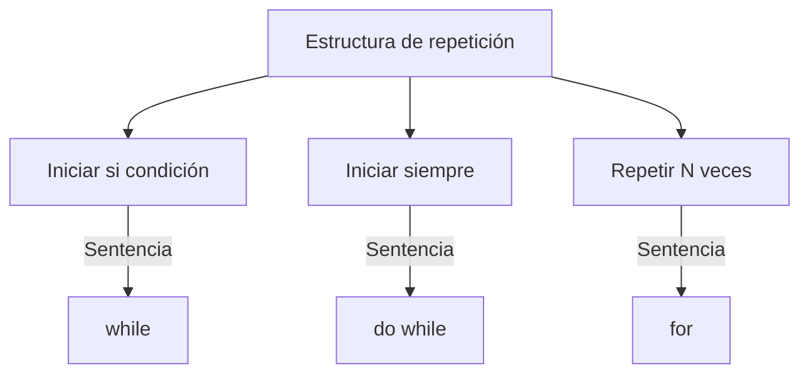
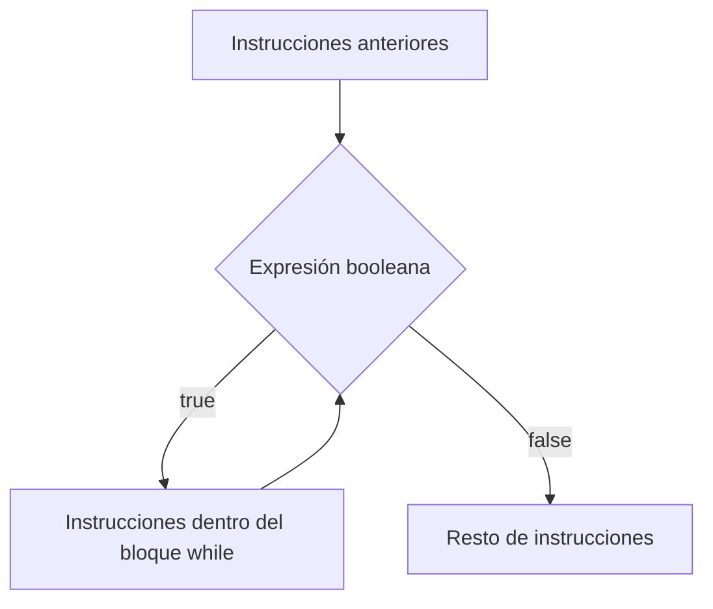
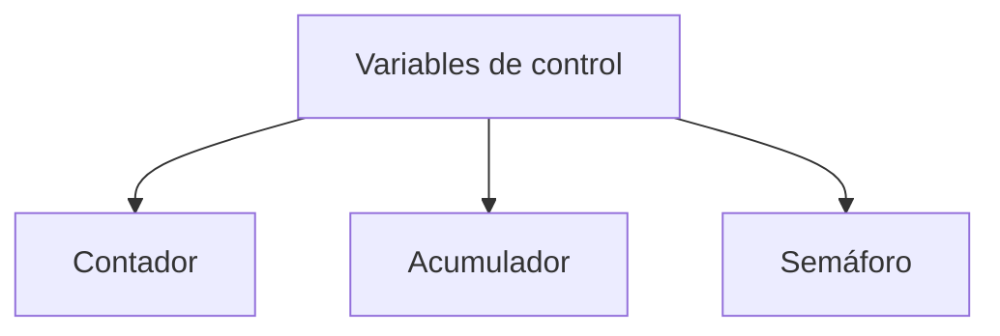
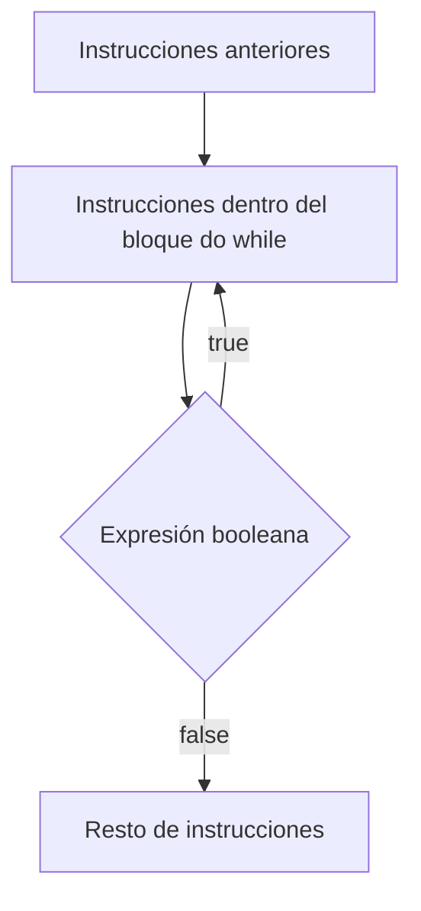
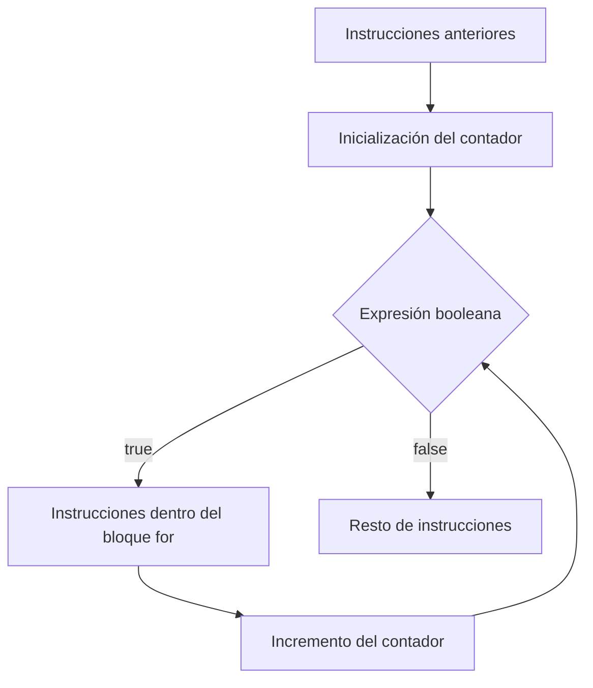

Las **estructuras de repetición** o iterativas permiten repetir una misma secuencia de instrucciones varias veces, mientras se cumpla una cierta condición.

Llamamos **bucle** o ciclo al conjunto de instrucciones que se debe repetir un cierto número de veces, y llamamos **iteración** a cada ejecución individual del bucle.



## Bucle `while`

La sentencia `while` permite repetir la ejecución del bucle mientras se verifique la condición lógica. Esta condición se verifica **al principio de cada iteración**. Si la primera vez, justo cuando se ejecuta la sentencia por primera vez, ya no se cumple, no se ejecuta ninguna iteración.

```java
Instrucciones anteriores ...

while (expresión booleana) {
    Instrucciones a ejecutar dentro del bucle;
}

Resto de instrucciones ...
```



### Ejemplo

```java
// Un programa que escribe una línea con 40 caracteres '*'.
public class Linea {
    public static void main(String[] args) {
        // inicializar un contador
        int i = 0;
        // ¿Ya hemos escrito * esto 40 veces?
        while (i < 40) {
            System.out.print('*');
            // Hemos escrito * una vez, sumamos 1 al contador
            i = i + 1;
        }
        // Forzamos un salto de línea
        System.out.println();
    }
}
```

## Control del bucle

Un **bucle infinito** es una secuencia de instrucciones dentro de un programa que itera indefinidamente, normalmente porque se espera que se alcance una condición que nunca se llega a producir.

Forzosamente, dentro de todo bucle debe haber instrucciones que manipulen el valor de alguna variable que nos permita controlar la repetición o el final del bucle. Estas variables se conocen como **variables de control**.



- **Contador**: variable de tipo entero que va aumentando o disminuyendo, indicando de manera clara el número de iteraciones que habrá que hacer.
- **Acumulador**: variable en la que se van acumulando directamente los cálculos que se quieren hacer, de manera que al alcanzar cierto valor se considera que ya no es necesario hacer más iteraciones.
- **Semáforo**: variable que sirve como interruptor explícito de si hay que seguir haciendo iteraciones. Cuando ya no queremos hacer más, el código simplemente se encarga de asignarle el valor específico que servirá para que la condición evalúe `false`.

:::warning[Cuidado con los bucles infinitos]
Si olvidas actualizar la variable de control dentro del bucle (por ejemplo, olvidar el `i = i + 1;`), la condición nunca cambiará y el programa se quedará ejecutando el bucle para siempre.
:::

### Ejemplo con contador

```java
import java.util.Scanner;
// Un programa que muestra la tabla de multiplicar de un número.
public class Multiplicar {
    public static void main(String[] args) {
        Scanner lector = new Scanner(System.in);
        System.out.println("¿Qué tabla de multiplicar quieres?");
        int tabla = Integer.parseInt(lector.next());
        lector.nextLine();

        // El contador servirá para hacer cálculos.
        int i = 1;
        while (i <= 10) {
            int resultado = tabla * i;
            System.out.println(tabla + "*" + i + "=" + resultado);
            i = i + 1;
        }
        System.out.println("Esta ha sido la tabla del " + tabla);
    }
}
```

### Ejemplo con acumulador

```java
import java.util.Scanner;
// Un programa que calcula el resto de una división a base de restas sucesivas.
public class Modulo {
    public static void main(String[] args) {
        Scanner lector = new Scanner(System.in);
        System.out.println("¿Cuál es el dividendo?");
        int dividendo = Integer.parseInt(lector.next());
        lector.nextLine();
        System.out.println("¿Cuál es el divisor?");
        int divisor = Integer.parseInt(lector.next());
        lector.nextLine();

        // ¿El dividendo es menor que el divisor?
        while (dividendo >= divisor) {
            // Restar el divisor al dividendo
            dividendo = dividendo - divisor;
            System.out.println("Bucle: por ahora el dividendo vale " + dividendo + ".");
            // repetimos el bucle para evaluar la condición
        }
        System.out.println("El resultado final es " + dividendo + ".");
    }
}
```

### Ejemplo con semáforo

```java
import java.util.Scanner;
// Un programa en el que hay que adivinar un número.
public class Adivina2 {
    public static final int VALOR_SECRETO = 4;

    public static void main(String[] args) {
        Scanner lector = new Scanner(System.in);
        System.out.println("Empezamos el juego.");
        System.out.println("Adivina el valor entero, entre 0 y 10.");

        boolean acierta = false;
        while (!acierta) {
            System.out.println("¿Qué valor crees que es?");
            int valor = Integer.parseInt(lector.next());
            lector.nextLine();

            // ¿El número es correcto?
            if (VALOR_SECRETO != valor) {
                System.out.println("Has fallado! Vuelve a intentarlo ...");
            } else {
                acierta = true;
            }
        }
        System.out.println("Enhorabuena. Por fin lo has acertado!");
    }
}
```

## Bucle `do while`

La sentencia `do / while` permite repetir la ejecución del bucle mientras se verifique la condición lógica. A diferencia de la sentencia `while`, la condición se verifica **al final de cada iteración**. Por lo tanto, independientemente de cómo evalúe la condición, al menos siempre se llevará a cabo la primera iteración.

```java
Instrucciones anteriores ...

do {
    Instrucciones a ejecutar dentro del bucle;
} while (expresión booleana);

Resto de instrucciones ...
```



:::note[`while` frente a `do while`]
Un `while` puede no ejecutarse nunca si la condición ya es falsa desde el principio. Un `do while` **siempre se ejecuta al menos una vez**, porque comprueba la condición al final. Se usa, por ejemplo, cuando hace falta pedir un dato como mínimo una vez, aunque luego haya que repetir la petición si no es válido.
:::

### Ejemplo

```java
import java.util.Scanner;
// Vamos a leer un entero entre 0 y 10.
public class ComprobarDato {
    public static void main(String[] args) {
        Scanner lector = new Scanner(System.in);
        int valor = 0;

        do {
            // Solicitar dato, como mínimo se pregunta una vez.
            System.out.println("Introduce un valor entero entre 0 y 10:");
            valor = Integer.parseInt(lector.next());
            lector.nextLine();
            // Comprobar dato.
        } while ((valor < 0) || (valor > 10));

        // Todo correcto
        System.out.println("Dato correcto. Has escrito " + valor);
    }
}
```

## Bucle `for`

La sentencia `for` permite repetir un número determinado de veces un conjunto de instrucciones. Reúne en una sola línea la inicialización del contador, la condición de parada y su incremento.

```java
Instrucciones anteriores ...

for (Inicialización contador; Expresión booleana; Incremento contador) {
    Instrucciones a ejecutar dentro del bucle;
}

Resto de instrucciones ...
```



### Ejemplo

```java
import java.util.Scanner;
// Un programa que muestra la tabla de multiplicar de un número usando for.
public class Multiplicar2 {
    public static void main(String[] args) {
        Scanner lector = new Scanner(System.in);
        System.out.println("¿Qué tabla de multiplicar quieres?");
        int tabla = Integer.parseInt(lector.next());
        lector.nextLine();

        // El contador servirá para hacer cálculos.
        // En lugar de i++ también se puede escribir i = i + 1
        for (int i = 0; i <= 10; i++) {
            int resultado = tabla * i;
            System.out.println(tabla + "*" + i + "=" + resultado);
        }
        System.out.println("Esta ha sido la tabla del " + tabla);
    }
}
```

:::tip[¿`while` o `for`?]
`for` es la opción más natural cuando sabemos de antemano cuántas veces hay que repetir el bucle (por ejemplo, recorrer una tabla del 0 al 10). `while` o `do while` encajan mejor cuando el número de iteraciones depende de una condición que no conocemos de antemano (por ejemplo, hasta que el usuario acierte un número).
:::