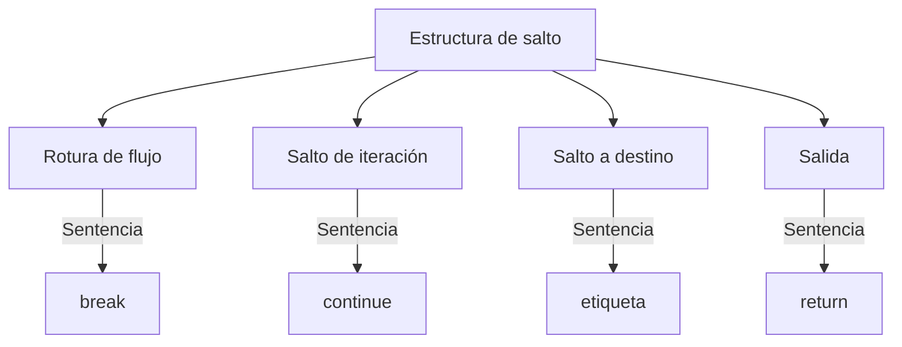
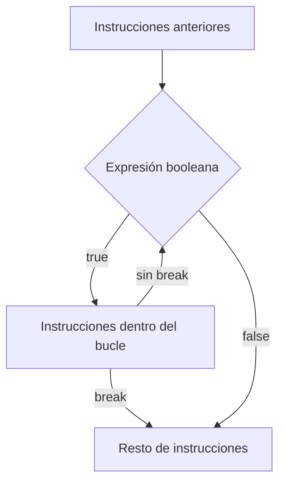
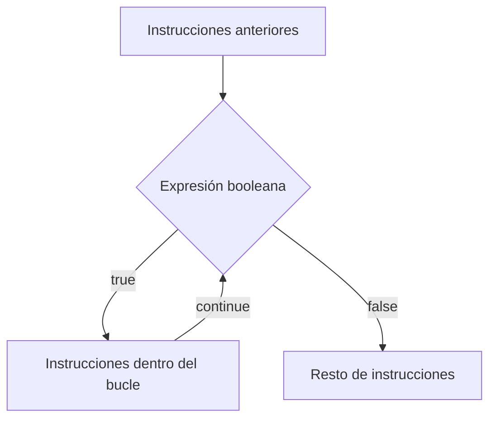

Una sentencia de **salto** nos permite transferir el control del programa de forma incondicional.



## Sentencia `break`

La sentencia `break` sirve para romper el flujo de control de un bucle, aunque no se haya cumplido la condición del bucle.



### Ejemplo

```java
// Un programa que muestra el uso de la sentencia break.
public class UsoBreak {
    // Declaramos el punto de salida del bucle.
    public static final int FIN = 10;

    public static void main(String[] args) {
        System.out.println("Este programa imprime los números del 1 al " + FIN);
        // iniciamos el bucle.
        for (int i = 0; i <= 100; i++) {
            if (i == FIN) {
                // Cuando se alcanza el valor del FINALIZADOR se sale del bucle
                System.out.println("Valor final: " + i);
                break;
            }
            System.out.println(i);
        }
        System.out.println("Fin del programa");
    }
}
```

:::note
`break` corta **inmediatamente** el bucle en el que se encuentra (sea `while`, `do while` o `for`), sin llegar a comprobar de nuevo la condición. El programa continúa por la primera instrucción que hay después del bucle.
:::

## Sentencia `continue`

La sentencia `continue` forzará a que se ejecute la siguiente iteración del bucle, sin tener en cuenta las instrucciones que pudiera haber después del `continue`, y hasta el final del código del bucle.



### Ejemplo

```java
// Un programa que muestra el uso de la sentencia continue.
public class UsoContinue {
    public static void main(String[] args) {
        System.out.println("Este programa imprime los números del 1 al 100 ...");
        // iniciamos el bucle.
        // imprimimos los números pares del 1 al 100
        for (int i = 0; i <= 100; i++) {
            // si el numero no es par salta otra iteración
            if (i % 2 != 0) continue;
            System.out.println(i);
        }
        System.out.println("Fin del programa");
    }
}
```

:::warning[`break` frente a `continue`]
No los confundas: `break` **abandona el bucle por completo**. `continue` **no sale del bucle**, sólo se salta el resto de instrucciones de la iteración actual y pasa directamente a comprobar la condición para la siguiente.
:::

## Salto a destino: etiquetas

Java permite poner una **etiqueta** delante de un bucle para poder referirnos a él desde un `break` o un `continue` situado dentro de un bucle anidado. Así se puede romper o saltar directamente el bucle exterior, no solo el más interno.

```java
Instrucciones anteriores ...

etiqueta:
for (Inicialización; Expresión booleana; Incremento) {
    for (Inicialización; Expresión booleana; Incremento) {
        // ...
        break etiqueta;    // rompe el bucle exterior, no solo el interior
    }
}

Resto de instrucciones ...
```

:::tip
Las etiquetas se usan poco y solo tienen sentido con bucles anidados: si un `break` o `continue` sin etiqueta ya hace lo que necesitas, no hace falta complicar el código con ellas.
:::

## Sentencia `return`

Un `return` es la instrucción utilizada en las funciones (métodos) para poder devolver un valor al procedimiento o función que la ha invocado. Además, en cuanto se ejecuta un `return`, el método termina inmediatamente: no se ejecuta ninguna instrucción posterior dentro de ese método.

### Ejemplo

```java
// Un programa que muestra el uso de la sentencia return.
import java.util.Scanner;
public class UsoReturn {

    public static int suma(int numero1, int numero2) {
        int resultado;
        resultado = numero1 + numero2;
        // Mediante return, este método devuelve el resultado de la suma
        return resultado;
    }

    public static void main(String[] args) {
        Scanner lector = new Scanner(System.in);
        // Solicitamos que el usuario introduzca dos números por consola
        System.out.println("Introduce el primer operando:");
        int primerNumero = Integer.parseInt(lector.next());
        lector.nextLine();
        System.out.println("Introduce el segundo operando: ");
        int segundoNumero = Integer.parseInt(lector.next());
        lector.nextLine();
        // Imprimimos los números introducidos
        System.out.println("Los operandos son: " + primerNumero + " y " + segundoNumero);
        System.out.println("obteniendo su suma... ");
        // Invocamos al método que realiza la suma, pasándole los parámetros adecuados
        System.out.println("La suma de ambos operandos es: " + suma(primerNumero, segundoNumero));
    }
}
```

:::note[`return` en un método `void`]
Un método declarado como `void` no devuelve ningún valor, pero también puede usar `return;` (sin ningún valor detrás) para terminar su ejecución antes de llegar al final del método, por ejemplo dentro de un `if` que detecta un caso especial.
:::