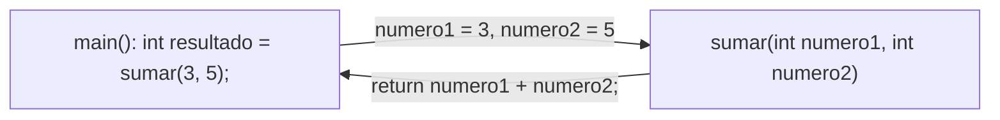

Una **función** (en Java, técnicamente un **método**) es un bloque de código independiente al que le damos un nombre, para poder ejecutarlo desde distintos puntos del programa sin tener que repetir su código cada vez. Nos permiten dividir un programa grande en piezas más pequeñas, reutilizables y fáciles de probar.

:::note[Función o método]
En Java, todo el código vive dentro de una clase: no existen funciones "sueltas" como en otros lenguajes. Por eso, a lo que en otros lenguajes se llama función, en Java se le llama **método**. En este curso usaremos ambos términos como sinónimos, ya que estamos definiendo siempre métodos estáticos dentro de nuestra clase.
:::

## Sintaxis de un método

```java
modificador tipoDeRetorno nombreDelMetodo(tipo parametro1, tipo parametro2, ...) {
    // cuerpo del método
    return valor; // solo si tipoDeRetorno no es void
}
```

| Parte | Descripción |
| --- | --- |
| `modificador` | Quién puede usar el método (`public`, `private`...) y si pertenece a la clase (`static`) o a cada objeto. |
| `tipoDeRetorno` | El tipo de dato que devuelve el método (`int`, `String`, `boolean`...), o `void` si no devuelve nada. |
| `nombreDelMetodo` | El identificador del método. Sigue las mismas reglas que las variables: **camelCase**, empezando por minúscula. |
| `(tipo parametro1, ...)` | La **lista de parámetros**: los datos que el método necesita para trabajar. Puede estar vacía. |

```java
public class Calculadora {

    // Un método sin parámetros y sin retorno (void)
    public static void saludar() {
        System.out.println("Bienvenido a la calculadora.");
    }

    // Un método con parámetros y con retorno (int)
    public static int sumar(int numero1, int numero2) {
        int resultado = numero1 + numero2;
        return resultado;
    }

    public static void main(String[] args) {
        saludar();
        int total = sumar(3, 5);
        System.out.println("El resultado es " + total);
    }
}
```

:::tip
Fíjate en que `saludar()` se invoca sin recoger ningún valor (no devuelve nada), mientras que `sumar(3, 5)` se invoca dentro de una expresión, porque su resultado se necesita para poder continuar.
:::

## Paso de parámetros

Los **parámetros** son las variables que aparecen en la definición del método, entre paréntesis; sirven como "huecos" que se rellenan cuando el método se invoca. Los **argumentos** son los valores concretos que se le pasan en cada llamada.

```java
public static int sumar(int numero1, int numero2) {   // numero1 y numero2 son parámetros
    return numero1 + numero2;
}
// ...
int resultado = sumar(3, 5);   // 3 y 5 son argumentos
```



### En Java, los parámetros se pasan siempre por valor

Cuando invocamos un método, Java **copia** el valor del argumento en el parámetro correspondiente. El método trabaja con esa copia, así que cualquier cambio que haga sobre el parámetro **no afecta** a la variable original que se pasó desde fuera.

```java
public static void incrementar(int numero) {
    numero = numero + 1;   // solo cambia la copia local
}

public static void main(String[] args) {
    int valor = 10;
    incrementar(valor);
    System.out.println(valor);   // sigue valiendo 10
}
```

:::warning[Matiz importante con objetos y arrays]
El paso siempre es "por valor", pero cuando el parámetro es un objeto o un array, lo que se copia es la **referencia** (la dirección de memoria), no el objeto entero. Por eso, si dentro del método se modifica el **contenido** del objeto o del array (por ejemplo, un elemento de un array), ese cambio **sí se ve** desde fuera; pero si dentro del método se reasigna el parámetro a un objeto nuevo, esa reasignación no afecta a la variable original.
```java
public static void ponerACero(int[] numeros) {
    numeros[0] = 0;   // modifica el contenido: SÍ se ve desde fuera
}
```
:::

### Número variable de parámetros: los `varargs`

Si un método debe admitir un número indeterminado de argumentos del mismo tipo, se puede usar la notación `...` (varargs). Dentro del método, el parámetro se trata como un array.

```java
public static int sumarTodos(int... numeros) {
    int total = 0;
    for (int numero : numeros) {
        total = total + numero;
    }
    return total;
}
// ...
System.out.println(sumarTodos(1, 2, 3));        // 6
System.out.println(sumarTodos(1, 2, 3, 4, 5));  // 15
System.out.println(sumarTodos());               // 0
```

## Retorno de valores

Un método puede **devolver** un valor a quien lo ha invocado mediante la sentencia `return`. El tipo de ese valor debe coincidir con el `tipoDeRetorno` declarado en la cabecera del método.

```java
public static boolean esPar(int numero) {
    return numero % 2 == 0;
}
```

:::warning[`return` termina el método inmediatamente]
En cuanto se ejecuta un `return`, el método finaliza en ese mismo instante: ninguna instrucción posterior dentro del método se llega a ejecutar. Esto permite tener varios `return` dentro de un mismo método, por ejemplo uno por cada caso de un `if`:

```java
public static String clasificar(int nota) {
    if (nota >= 5) {
        return "Aprobado";
    }
    return "Suspenso";
}
```
:::

### Métodos `void`: sin retorno

Cuando un método no necesita devolver ningún valor (por ejemplo, porque solo muestra algo por pantalla), se declara con el tipo `void`. Un método `void` puede usar `return;` sin ningún valor detrás, únicamente para terminar su ejecución antes de tiempo.

```java
public static void avisar(int stock) {
    if (stock <= 0) {
        System.out.println("Sin stock.");
        return;   // no tiene sentido seguir comprobando nada más
    }
    System.out.println("Quedan " + stock + " unidades.");
}
```

:::note
Un método `void` **no se puede usar dentro de una expresión**: `int x = avisar(5);` sería un error de compilación, porque `avisar` no devuelve ningún valor que pueda guardarse en `x`.
:::

## Sobrecarga de métodos (*overloading*)

Java permite definir **varios métodos con el mismo nombre**, siempre que se distingan por su lista de parámetros (distinto número de parámetros, o distinto tipo). Esto se llama **sobrecarga**. Java decide qué versión ejecutar según los argumentos con los que se le invoque.

```java
public static int sumar(int numero1, int numero2) {
    return numero1 + numero2;
}

public static double sumar(double numero1, double numero2) {
    return numero1 + numero2;
}

public static int sumar(int numero1, int numero2, int numero3) {
    return numero1 + numero2 + numero3;
}
```

```java
sumar(2, 3);        // usa la versión (int, int)
sumar(2.5, 3.1);     // usa la versión (double, double)
sumar(2, 3, 4);      // usa la versión (int, int, int)
```

:::warning
No se puede sobrecargar un método cambiando **únicamente** el tipo de retorno: dos métodos con el mismo nombre y los mismos parámetros, pero distinto tipo de retorno, no son válidos y el compilador dará error.
:::

## Documentación de métodos: Javadoc

Java tiene su propio formato de comentarios de documentación, llamado **Javadoc**, que empieza por `/**` (dos asteriscos) y permite generar automáticamente documentación en HTML a partir del código. Se coloca justo encima del método que se documenta.

```java
/**
 * Calcula el precio final de un producto aplicando un descuento.
 *
 * @param precio    el precio original del producto, en euros
 * @param descuento el porcentaje de descuento a aplicar (0-100)
 * @return el precio final ya con el descuento aplicado
 */
public static float aplicarDescuento(float precio, float descuento) {
    return precio - (precio * descuento / 100);
}
```

| Etiqueta | Descripción |
| --- | --- |
| `@param nombre descripción` | Documenta un parámetro del método. Se pone una línea por cada parámetro, en el mismo orden en que aparecen. |
| `@return descripción` | Documenta el valor que devuelve el método. No se usa si el método es `void`. |
| `@throws Excepcion descripción` | Documenta una excepción que el método puede lanzar (lo veremos más adelante). |

:::tip[Buenas prácticas al documentar]
- La primera línea debe ser una frase breve que resuma **qué hace** el método (no cómo lo hace).
- Documenta el **qué**, no repitas el nombre de la variable: `@param precio el precio original del producto` es mejor que `@param precio el precio`.
- Muchos editores (como IntelliJ o VS Code) generan automáticamente la plantilla del Javadoc si escribes `/**` justo encima del método y pulsas Intro.
:::

## Ámbito de los parámetros y variables locales

Los parámetros de un método se comportan como **variables locales**: solo existen mientras el método se está ejecutando, y solo pueden usarse dentro de su cuerpo. Al terminar el método, tanto sus parámetros como cualquier variable declarada dentro de él desaparecen.

```java
public static int cuadrado(int numero) {
    int resultado = numero * numero;   // variable local, solo existe aquí
    return resultado;
}
// System.out.println(resultado);   // error: resultado no existe fuera del método
```